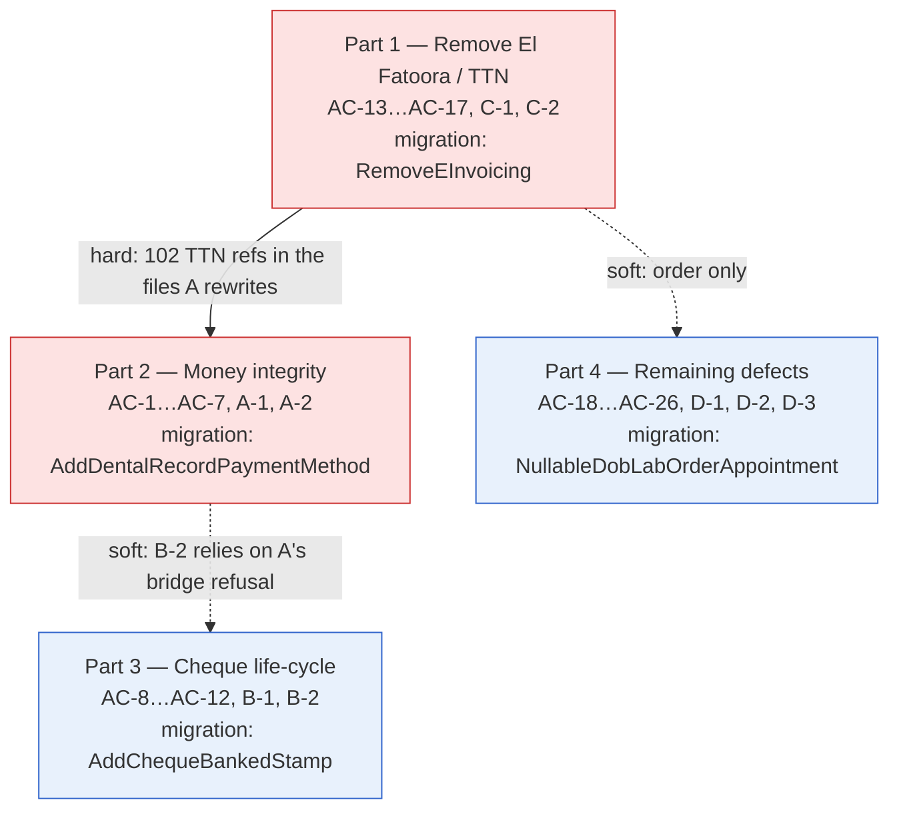

# Adoption Gaps Remediation — Implementation Stories

**Status:** APPROVED
**Plan:** [../plan.md](../plan.md)
**Spec:** [../spec.md](../spec.md)
**Audit source:** [../../../ADOPTION-AUDIT.md](../../../ADOPTION-AUDIT.md)

## Summary

`ADOPTION-AUDIT.md` found that the clinical spine is sound but **money can silently leave the system**, and
that several fully-built features are unreachable. This feature closes the confirmed money leaks, gives a
cheque a banked state, removes the TTN « El Fatoora » e-invoicing subsystem entirely, and fixes the remaining
small defects.

## Story structure — one story, four ordered parts

This breakdown deliberately **departs from the skill's BE/FE separation rule**. The plan settles the
granularity question explicitly and records it as **R-1** ("The owner chose one story explicitly against the
sizing recommendation. Recorded, not re-litigated."), so it is materialized as written: **one `Layer: Full`
story** whose steps are grouped into **four ordered, dependency-respecting parts**.

Each part is a **vertical increment** (Domain → EF → migration → Application → API → web → docs → tests) that
builds, passes its own validation and **commits on its own**. The part boundary is the split point when a
session runs out — which is exactly the shape `/implement-story` detects and prompts on, so each session
implements **one part**.

### Why the parts run C → A → B → D, not the spec's A → D

Exploration found a hard overlap the spec did not account for: `Invoice.cs` carries **102** TTN references,
`CreateInvoiceFromDentalRecordCommand` **10** and `IssueInvoiceCommand` **16** — the exact files Group A
rewrites. Deleting El Fatoora first means Group A's typed result is written **once**, into a command with no
e-invoice branches, and AC-14's `CanCancel` rewrite lands before Group A touches cancellation wording.
Groups B and D are disjoint from both and keep their spec order.

## Part Dependencies

**Only Part 1 must precede Part 2.** Parts 2, 3 and 4 are independent of each other; Part 3's B-2 check reads
better after Part 2 makes the bridge refusal say what it means, but does not require it.

## Status Tracker

| Story | Layer | Name | Status | Depends On |
|-------|-------|------|--------|------------|
| 1 | Full | Close the adoption gaps | in-progress (2/4 parts) | - |

### Part tracker (the real unit of work — one part per session)

| Part | Group | Name | ACs | Migration | Status | Depends On |
|------|-------|------|-----|-----------|--------|------------|
| 1 | C | Remove El Fatoora / TTN | AC-13, 14, 15, 16, 16b, 16c, 17, C-1, C-2 | `RemoveEInvoicing` (irreversible) | **implemented** | - |
| 2 | A | Money integrity | AC-1, 2, 3, 3b, 4, 5, 6, 7, A-1, A-2 | `AddDentalRecordPaymentMethod` | **implemented** | Part 1 |
| 3 | B | Cheque life-cycle | AC-8, 9, 10, 11, 12, B-1, B-2 | `AddChequeBankedStamp` | not-started | - |
| 4 | D | Remaining defects | AC-18…AC-26, D-1, D-2, D-3 | `NullableDobLabOrderAppointment` | not-started | - |

## Scale

~100 files across Domain, Application, Infrastructure, API, `web/`, docs and tests, plus **four** migrations
and a whole subsystem deletion. Well past the ~10-12 file session heuristic — hence the part-by-part landing.

## Out of scope (owner's explicit exclusions)

Relances/recall, phone normalisation, every CNAM item, Arabic/RTL, the split working day, un-bridging a
devis→facture passerelle, changing when la caisse recognises a cheque, patient merge / soft delete, any
change to the invoice/devis/avoir numbering series, deleting orphaned e-invoice blobs from object storage,
repricing a billed fiche, backfilling existing `"Unknown"` insurance rows or fabricated DOBs, and **the full
English-string sweep of `api/`** (~90 Application sites + 100+ Domain `ArgumentException` messages — its own
follow-up feature).
