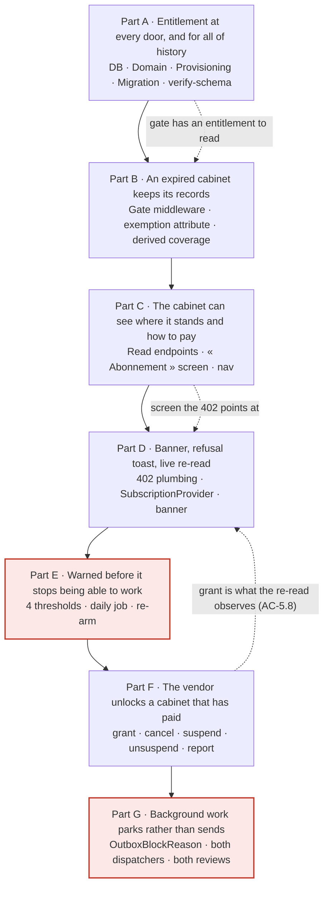

# Abonnement du cabinet — Implementation Stories

**Status:** APPROVED
**Plan:** [../plan.md](../plan.md) (APPROVED · Challenged: Yes)
**Spec:** [../spec.md](../spec.md) (APPROVED · Challenged: Yes)
**Companion (not broken down here):** [../../platform-console/spec.md](../../platform-console/spec.md)

## Summary

On the hosted multi-tenant deployment, a cabinet's right to **record new work** becomes a dated entitlement: one
`ClinicSubscription` per clinic whose `EndsOn` is a full re-fold of an append-only, cancellable `SubscriptionPeriod`
ledger. A new cabinet gets **30 free days**; past its date it is **read-only** — every read, every CSV export and every
PDF still works, and only writes are refused, with **HTTP 402** and a French sentence naming the date. Enforcement is a
single middleware; the exempt set is an attribute on each action, pinned by a derived coverage test. Everything is gated
on a new 16th `DeploymentProfile` capability, `RequiresSubscription`, true for `HostedMultiTenant` only.

## Story Dependencies

**One story, seven ordered parts.** The single-story shape is a deliberate, recorded decision (plan §*Deviations*,
risk **R-1**), taken against the sizing heuristic; the parts are the increments and the split points. The diagram
below therefore shows the **parts** inside Story 1, because that is where the ordering lives.

Parts outlined in red are **atomic** — see *Split points* below.

## Status Tracker

| Story | Layer | Name | Status | Depends On |
|-------|-------|------|--------|------------|
| 1 | Full | [Abonnement du cabinet — entitlement, enforcement, visibility and vendor control](./story-1-full-clinic-subscription.md) | in-progress (Parts A + B + C + D + E + F done) | - |

### Parts inside Story 1

| Part | Focus | Layer weight | Atomic? | Depends on | Status |
|---|---|---|---|---|---|
| A | Every cabinet has an entitlement, at every door and for all of history | BE | — | — | **done** — Checkpoint A green; see [progress.md](./progress.md) |
| B | An expired cabinet keeps its records and loses only recording | BE | — | A | **done** — Checkpoint B green; see [progress.md](./progress.md) |
| C | The cabinet can see where it stands and how to pay | BE + FE | — | A, B | **done** — Checkpoint C green; the eye pass is owed (no browser here). See [progress.md](./progress.md) |
| D | The banner, the refusal toast, and the live re-read | FE | — | C | **done** — Checkpoint D green; the eye pass is owed (no browser here). Also closes Part C's interim rail row (AC-7.1/7.2). See [progress.md](./progress.md) |
| E | The cabinet is warned before it stops being able to work | BE + FE | **yes** | A | **done** — Checkpoint E green, three executed red-proofs. Carries two `web/` edits the plan's table did not list, so AC-3.4's deep-link is real (progress.md DEV-8). See [progress.md](./progress.md) |
| F | The vendor unlocks a cabinet that has paid | BE | — | A | **done** — Checkpoint F green, two executed red-proofs. It also fixed a derived guard that had never checked a console verb (progress.md DEV-11). See [progress.md](./progress.md) |
| G | Background work parks rather than sends or vanishes | BE | **yes** | A, F | not-started — the only part left |

## Departure from the BE/FE separation rule

`Layer: Full`, deliberately. This skill's default is one layer per story, and it is overridden here because the plan's
single-story decision is a recorded user decision rather than an omission (plan §*Deviations*, **R-1**). The steps are
grouped **by part**, and each part is a vertical increment with its own commit and its own validation block, so the
internal ordering is explicit even though the story spans both layers. Layer weight per part is in the table above:
A, B, E, F and G are `api/`-only; **D** is `web/`-only; **C** is the one genuinely mixed part (two read endpoints plus
the screen that consumes them).

## Split points

**R-1** names the part boundaries as the split points, and the two most natural halves are **A|B|C** and **D|E|F|G** —
A–C is a complete, shippable « the entitlement exists, is enforced, and is visible » increment. Two boundaries are
**not** available:

- **Inside Part E.** `StaffNotificationRules` *throws* on an unclassified category, so
  `NotificationCategory.SubscriptionExpiring` and `ReachesALockedPhone → false` must land in the **same commit** or
  **every** notification write in the product breaks, not only the new one (**R-9**).
- **Inside Part G.** Parking rows without the matching un-park term releases every parked reminder within a minute, on
  a cabinet that has not paid (**R-8**, and FR-8's named gap).

## Safety window

After Part A ships, every pre-existing cabinet is open-ended and every new one has 30 days — so **no cabinet anywhere
can be refused for at least 30 days after deployment**. The intermediate states between parts are therefore safe to
ship in order, and Part B's gate lands long before it can refuse anybody.
