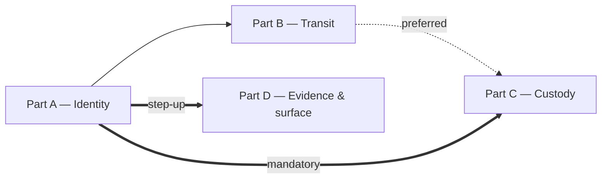

# Hosted Security Hardening — Implementation Stories

**Status:** APPROVED (2026-08-12)
**Plan:** [../plan.md](../plan.md) (APPROVED · Challenged 2026-08-12)
**Spec:** [../spec.md](../spec.md) (APPROVED 2026-08-12)
**Carried context:** [../exploration.md](../exploration.md) — every `file:line` fact this work rests on

---

## ⚠️ Where this work happens — read this first in a new session

| | |
|---|---|
| **Worktree** | `.claude/worktrees/hosted-security-hardening/` |
| **Branch** | `feature/hosted-security-hardening` |
| **Branched from** | `9a90d54` — the tip of `feature/windows-desktop-app` |
| **Created** | 2026-08-12 |

**Open a new session with that worktree directory as the working directory.**

⚠️ **Do not `git checkout` or `git switch` this branch in the main checkout**
(`C:\Users\Oumayma Benkhalifa\Desktop\clinic-management`) — that tree stays on `feature/windows-desktop-app`
deliberately, holds 40+ uncommitted modifications from other work, and must remain open.

**Base is `9a90d54`, not `main`,** because `main` is 338 commits behind and lacks `ConsolePortGate`,
`PlatformReadShape` and `ClinicArchiveRestorer` — files this story modifies and the exploration cites. The worktree
starts **clean**: it carries everything committed at that tip and none of the main tree's in-flight edits, so
`git status` there shows only this feature's work.

The copy of these docs in the main tree is a **pointer**; the working copy is the one in the worktree. Full rationale is
in the story file's own worktree section.

## Summary

Harden every layer behind the TLS edge on `HostedMultiTenant` — identity, transit, key custody and evidence — so that
a stolen credential, a stolen disk or a stolen backup does not yield a practice's medical records, and so that what
happened to that data can be reconstructed afterwards. `SelfHostedLan` behaves exactly as before; `CloudBrowser`
receives only the five changes the spec declares global (password floor · session cookies · audit chain · logging ·
and, through the shared compose files, **transit**).

## One story, four parts

This is **one user story** — the spec's own US-1, planned that way at the user's explicit direction against the sizing
heuristic — delivered in **four ordered parts**. Everything lives in a single file:

### 📄 [story-1-full-hosted-security-hardening.md](./story-1-full-hosted-security-hardening.md)

| Part | Delivers | Plan part |
|------|----------|-----------|
| **A** | **Identity** — a second factor for administrators, replay detection, a served password floor, step-up | Part 1 |
| **B** | **Transit** — every internal hop encrypted and verified, fail-loud on misconfiguration | Part 2 |
| **C** | **Custody** — nothing readable from a stolen disk or backup, and a written answer to "where are the keys" | Part 3 |
| **D** | **Evidence & surface** — a tamper-evident ledger, an attributable export, an enforcing policy | Part 0 + Part 4 |

The plan has five parts (0–4). **Part 0 folds into Part D**: it exists only to make Part D's gate meaningful
("Part 0 before Part 4 is required" is its sole dependency), so it becomes Part D's opening step (D.0) rather than
standing alone. That is what makes four.

Each part is a **self-contained vertical increment with its own commit, its own gate run and its own revert
procedure** — the plan's own words, and the reason the part boundary is also the session boundary. Record progress per
part in `progress.md`.

## Part ordering



From the plan's *Deploy order*:

- **A before C is mandatory**, not preferred: Part C re-protects the Data Protection key ring and Part A's second
  factors live on it. Part C must keep the existing keys as decryptors and migrate the ciphertext — **never mint a
  fresh ring** (R-2).
- **A before D is required**: Part D's step-up comes from Part A.
- **B before C** is preferred, not required.

## Status Tracker

| Part | Name | Plan part | Status |
|------|------|-----------|--------|
| A | Identity | Part 1 | **implemented** |
| B | Transit | Part 2 | **implemented** |
| C | Custody | Part 3 | **implemented** |
| D | Evidence & surface | Part 0 + Part 4 | not-started |

**Story Status:** in-progress (A + B + C implemented; **D** next) · **Layer:** Full · **Depends On:** None

### Part A's internal sub-parts

Part A is the largest by some distance (32 steps, ~40 files across Domain, Application, Infrastructure, API, a
migration, `web/` and `console/`), so it carries four internal sub-parts of its own:

| Sub-part | Covers | Plan increments |
|----------|--------|-----------------|
| A.1 | The capability and the served password floor | 1.1 |
| A.2 | The factor itself, and the login screen that enrols it *(the first migration)* | 1.2 |
| A.3 | « Sécurité », step-up, and the three ways back | 1.3 + 1.4 |
| A.4 | A session that cannot be replayed, a cookie that cannot be moved, and the guards | 1.5 + 1.6 |

## Departures from the `/break-plan` defaults, recorded rather than left implicit

1. **One story, not one per layer.** The BE/FE separation rule is overridden because each part *is* a vertical
   increment: Part A's cookie work (increment 1.5) is inherently both halves at once, and splitting Part D's log scrub
   from its durable-log volume would land them in different commits, which FR-4.4 explicitly forbids (*"making logs
   durable persists what was previously ephemeral, so the scrub must land in the same change, not after it"*).
2. **The story far exceeds the sizing guidance and stays one file**, at the user's direction. Its four parts — and
   Part A's four sub-parts — are the seams if the work is ever divided further.

## Delivery

One branch, **one commit per part** (Part A: one commit per sub-part is also acceptable), **one PR at the end**.

**Known revert asymmetries** (plan *Deploy order and rollback*):

- Reverting **Part A** signs everyone out a **second** time — the cookie rename reverses.
- Reverting **Part C**'s file-based secrets after the environment values are deleted is a hard startup failure.
- Reverting **Part D** after the audit chain is populated leaves a permanent declared boundary when re-applied.

## Cross-cutting gate, run at the end of every part

The backend unit suite is the **only** automated check the API has and nothing in it touches a database, so a
migration is verified by `verify-schema` (run **before and after**, outputs **diffed**) and every frontend claim is
verified by the three commands plus an eye pass. `web/` has no test runner, no working ESLint and no CI — that *is*
the gate.

```bash
# backend — Release, built outside the repo (Smart App Control + the running API's bin lock)
dotnet test api/ClinicManagement.UnitTests/ClinicManagement.UnitTests.csproj -c Release -p:BaseOutputPath=<temp>

# frontend — in web/ AND in console/
npm run check:responsive && npx tsc --noEmit && npm run build
```

Then an eye pass at **320 / 390 / 820 / 1180 / 1440**, plus a landscape phone, plus with the on-screen keyboard up.

⚠️ Never `--no-build`. ⚠️ In PowerShell never end a `BaseOutputPath` argument with a backslash inside double quotes —
the trailing `\"` escapes the quote, MSBuild silently builds to `bin/` and reports success. ⚠️ Smart App Control
intermittently refuses freshly-built test assemblies (`0x800711C7`); treat a block as **transient and retry**.
