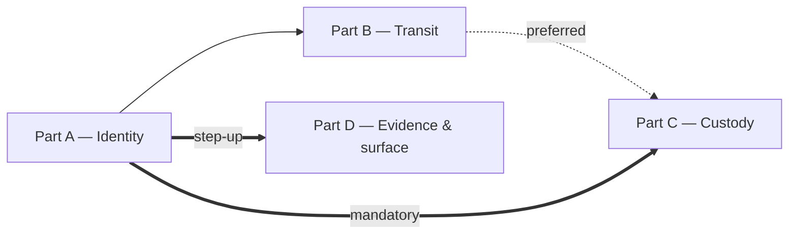

# Story 1: Full — Hosted security hardening

**Status:** APPROVED
**Story Status:** not-started
**Layer:** Full — Domain · Application · Infrastructure · API · Deploy · UI · Docs
**Depends On:** None
**Blocks:** None
**Plan:** [../plan.md](../plan.md) (APPROVED · Challenged 2026-08-12) — US-1
**Spec:** [../spec.md](../spec.md) (APPROVED 2026-08-12)
**Carried context:** [../exploration.md](../exploration.md) — every `file:line` fact this story rests on

---

## ⚠️ Where this work happens — read this first in a new session

| | |
|---|---|
| **Worktree** | `.claude/worktrees/hosted-security-hardening/` |
| **Branch** | `feature/hosted-security-hardening` |
| **Branched from** | `9a90d54` — the tip of `feature/windows-desktop-app` |
| **Created** | 2026-08-12 |

**Open a new session with that worktree directory as the working directory.** Every path in this file is repo-relative
and resolves inside it.

⚠️ **Do not `git checkout` or `git switch` this branch in the main checkout**
(`C:\Users\Oumayma Benkhalifa\Desktop\clinic-management`). That tree stays on `feature/windows-desktop-app`
deliberately — it holds 40+ uncommitted modifications from other work and must remain open and undisturbed.

**Why the base is `9a90d54` and not `main`:** `main` is **338 commits behind** and does not contain
`ConsolePortGate`, `PlatformReadShape` or `ClinicArchiveRestorer` — three of the files this story's steps modify and
`exploration.md` cites by line. A worktree branched from `main` would make the plan unimplementable as written.

**What the worktree does and does not carry:**

- ✅ Everything committed at `9a90d54`, which is all the code the plan and exploration were verified against
- ✅ This `features/hosted-security-hardening/` folder, **copied in** (it is untracked in the main tree, so it does not
  travel with a worktree automatically) — and **uncommitted here too**, so commit it with the first part
- ❌ The main tree's 40+ uncommitted modifications, and the untracked
  `api/ClinicManagement.API/Controllers/Platform/PlatformClinicRestoreController.cs`. **This is an improvement, not a
  loss:** the worktree starts clean, so `git diff HEAD --numstat` here shows only your own work and no commit can
  swallow somebody else's
- ⚠️ The copy of these docs in the main tree is now a **pointer, not the working copy**. Edit them here. Delete the
  main-tree copy whenever you like — nothing depends on it

## Objective

Harden every layer behind the TLS edge on `HostedMultiTenant` — identity, transit, key custody and evidence — so that
a stolen credential, a stolen disk or a stolen backup does not yield a practice's medical records, and so that what
happened to that data can be reconstructed afterwards. `SelfHostedLan` behaves exactly as before; `CloudBrowser`
receives only the five changes the spec declares global (password floor · session cookies · audit chain · logging ·
and, through the shared compose files, **transit**).

**This is the spec's own single user story**, planned that way at the user's explicit direction against the sizing
heuristic. It is delivered in **four ordered parts**, each a self-contained vertical increment with its own commit, its
own gate run and its own revert procedure. The part boundary is the session boundary — record progress per part in
`progress.md`.

| Part | Delivers | Plan part | Steps |
|------|----------|-----------|-------|
| **A** | Identity — a second factor, replay detection, a served password floor, step-up | Part 1 | A.1 – A.4 |
| **B** | Transit — every internal hop encrypted and verified, fail-loud | Part 2 | B.1 – B.11 |
| **C** | Custody — nothing readable from a stolen disk or backup, and a written answer to "where are the keys" | Part 3 | C.1 – C.5 |
| **D** | Evidence & surface — a tamper-evident ledger, an attributable export, an enforcing policy | Part 0 + Part 4 | D.0 – D.4 |

**Ordering, from the plan's *Deploy order*:**

- **A before C is mandatory**, not preferred: Part C re-protects the Data Protection key ring and Part A's second
  factors live on it. Part C must keep the existing keys as decryptors and migrate the ciphertext — never mint a fresh
  ring (R-2).
- **A before D is required**: Part D's step-up comes from Part A.
- **B before C** is preferred, not required.
- **D opens with the restore verification** (the plan's Part 0), because Part D's gate is "confirm the archive is
  refused when the ledger cannot be written" and that cannot be verified against an operation that persists nothing.
  It is Part 0's only dependent, which is why it folds in here rather than standing alone.



## Acceptance Criteria

_From spec — the story as a whole:_

- [ ] **AC-1** — an attacker holding a clinic administrator's password alone cannot sign in, cannot export a
      practice's records, and cannot read a patient's file *(Part A, Part D)*
- [ ] **AC-2** — an attacker with a shell on the host, or a packet capture on the container network, reads no patient
      data in flight *(Part B)*
- [ ] **AC-3** — an attacker holding a copy of the database volume, the object-store volume, or an off-site backup
      archive reads no patient data at rest *(Part C)*
- [ ] **AC-4** — every export of a practice's complete record is attributable to a person and a moment, and the record
      of it cannot be silently removed *(Part D)*
- [ ] **AC-5** — every one of the above is enforced by something the build or `verify-schema` checks, not by a
      configuration key somebody remembered to set *(all four parts)*
- [ ] **AC-6** — nothing in `SelfHostedLan` or `CloudBrowser` regresses, except where a change is explicitly stated as
      global *(all four parts)*
- [ ] **AC-7** — no practice is ever locked out of its own records by a control introduced here; every new gate has a
      stated recovery path and every recovery path is reachable by somebody *(Part A, Part C)*

_Per part:_ **FR-1.1 – FR-1.10** (+ FR-1.7a) in Part A · **FR-2.1 – FR-2.7** in Part B ·
**FR-3.1 – FR-3.11** in Part C · **FR-4.1 – FR-4.6** in Part D. Each part's own section lists them.

_Story-specific (each surfaced by the challenge pass; the part that owns it is named):_

- [ ] `SessionFamily` is in `ApplicationDbContext.SkipsConcurrencyToken`, and two tabs refreshing at once **both**
      succeed *(A.4)*
- [ ] The session cookie **name** resolves through one helper used by every writer *and* reader *(A.4)*
- [ ] `StepUpConfirmations` is a singleton over `IMemoryCache`; a confirmation minted in one request is found in
      another *(A.3)*
- [ ] The console reads the password floor from a `/api/platform` endpoint, not `/api/auth/mode` *(A.1)*
- [ ] A per-request enrolment refusal routes the browser to the enrolment screen *(A.4)*
- [ ] `TransportAssurance` gates on `!SelfHostsFrontDoor` — both hosted kinds — and transit is recorded as the fifth
      global change *(B)*
- [ ] The key ring's **existing ciphertext is migrated** and the superseded plaintext key files are deleted only after
      `verify-schema` reads zero *(C.1)*
- [ ] Null-`ClinicId` audit rows are chained too, on their own deployment-wide chain, through a derived `ChainKey`
      column *(D.1)*
- [ ] The advisory lock, the previous-hash read and the insert share **one explicit transaction** *(D.1)*

## Entry Criteria

Before starting this story, ensure:

- [ ] Working directory is the **worktree** — `.claude/worktrees/hosted-security-hardening/` — on branch
      `feature/hosted-security-hardening` (confirm with `git branch --show-current`)
- [ ] `exploration.md` § 0 read in full; each part's own section read before that part begins
- [ ] `git status --porcelain` shows only this feature's own changes. The worktree starts clean at `9a90d54`, so unlike
      the main checkout there are **no** 40+ in-flight modifications to work around — if you see any, something else is
      writing here
- [ ] Backend suite green **before** any change, so a later failure is attributable
- [ ] `web/` and `console/` both build clean before any change
- [ ] `verify-schema` run and its output saved as the before-baseline
- [ ] Host root access confirmed (spec *Dependencies*: "Confirmed available") — needed in Part C
- [ ] Off-site storage supporting client-side encryption available — needed in Part C

## Cross-cutting gate, run at the end of every part

The backend unit suite is the **only** automated check the API has and nothing in it touches a database, so a
migration is verified by `verify-schema` (run **before and after**, outputs **diffed**) and every frontend claim is
verified by the three commands plus an eye pass. `web/` has no test runner, no working ESLint and no CI — that *is*
the gate.

```bash
# backend — Release, built outside the repo (Smart App Control + the running API's bin lock)
dotnet test api/ClinicManagement.UnitTests/ClinicManagement.UnitTests.csproj -c Release -p:BaseOutputPath=<temp>

# frontend — in web/ AND in console/
npm run check:responsive && npx tsc --noEmit && npm run build
```

Then an eye pass at **320 / 390 / 820 / 1180 / 1440**, plus a landscape phone, plus with the on-screen keyboard up.

⚠️ Never `--no-build`. ⚠️ In PowerShell never end a `BaseOutputPath` argument with a backslash inside double quotes —
the trailing `\"` escapes the quote, MSBuild silently builds to `bin/` and reports success. ⚠️ Smart App Control
intermittently refuses freshly-built test assemblies (`0x800711C7`); treat a block as **transient and retry**, do not
rewrite the run strategy around it.

---

# Part A — Identity

**Delivers:** a clinic administrator on the hosted deployment can no longer sign in with a password alone; they present
a time-based code, enrol one on the login screen itself if they have not, and have three separate ways back if they
lose it. Doctors and secretaries may enrol voluntarily from a « Sécurité » screen reachable by every role. A replayed
session credential is detected and ends **only that device's** session. The password floor rises to 12, is served, and
is read by every client that states it. Sensitive actions can demand a fresh password or code through a step-up that
spends its own failure counter.

**Acceptance criteria:** AC-1, AC-5, AC-6, AC-7 · FR-1.1 – FR-1.10 (+ FR-1.7a) · **FR-4.3's mechanism** (the step-up
itself ships here; Part D applies it to the archive) · Part 1's eight edge-case rows · the Device & Interface rows for
login-with-a-code-field, the code field, the enrolment step, recovery codes, the step-up dialog, everywhere, buttons ·
Stated Assumptions 1, 2, 3, 4, 5, 6, 7, 8, 10, 11.

**Entry:** `exploration.md` § 1 read — § 1.1 gives the exact check order, refusal codes and entity shapes to
**mirror, not re-invent**. A.2 carries the story's first migration.

## A.1 — The capability and the served password floor *(plan increment 1.1, steps 1–7)*

1. **Add the 18th deployment capability**
   - `api/ClinicManagement.Infrastructure/Deployment/DeploymentProfile.cs` — `RequiresAdminSecondFactor`, ✓ for
     `HostedMultiTenant` **alone**, via `exploration.md` § 5.2's five edits (ctor parameter · assignment · public
     get-only property with an XML doc stating *why each ✗ is its own decision* · one literal per kind in `For(kind)`
     with an inline reason · the `ExpectedMatrix` row)
   - The ✗ reasoning: on a clinic's own PC, an administrator locked out with no vendor to call is worse than the threat
   - ⚠️ Also add the `hostedOnlyCapabilities` entry, or
     `Both_pre_existing_kinds_reproduce_the_old_IsLocalMode_truth_table` fails
   - Outcome: `Every_capability_is_covered_by_the_matrix` passes — it reflects every `bool` property and fails without
     the row

2. **Raise the floor to 12, on the set path only**
   - `api/ClinicManagement.Application/Common/PasswordPolicy.cs` — `MinLength` 8 → **12**
   - Confirm all five enforcement sites are on *set*, never on a check: `CreateClinicCommand`, `JoinClinicCommand`,
     `SignUpClinicCommand`, `ChangePasswordCommand`, `ChangePlatformPasswordCommand`
   - Outcome: existing passwords keep working; a new or changed one under 12 is refused

3. **Make generated passwords follow the floor**
   - `LocalAuthService.GenerateTemporaryPassword` derives its length from `PasswordPolicy.MinLength` rather than
     coinciding with it (it is 12 today by accident), so a raised floor cannot silently outrun the generator

4. **Serve the floor and the requirement**
   - `passwordMinLength` + `requiresSecondFactor` on `GET /api/auth/mode`, mirroring how `trialDays` is already served

5. **Replace the five client literals with the served value**
   - `web/components/change-password-form.tsx` (the `MIN_PASSWORD_LENGTH` const), `web/components/join-wizard.tsx`
     (×2), `web/components/setup-wizard.tsx` (×2)
   - ⚠️ **`setup-wizard`'s rule moves out of the `if (isLocalMode)` branch.** It serves both first-run setup *and*
     public signup, and `mode` is fetched asynchronously — so before it resolves, the signup flow validates step 2
     against the Cloud branch and never checks the password at all. Gate on *"this step collects a password"*, not on
     the deployment

6. **Serve the floor to the console, on a path the console can reach**
   - ⚠️ **The console cannot call `GET /api/auth/mode`.** `console/lib/api/client.ts:11` points at
     `http://api:5443/api` — the console listener — and `ConsolePortGate` refuses **both** directions on it: anything
     not under `/api/platform` is 404, matched with `StartsWithSegments` (`ConsolePortGate.cs:41, 69-70`)
   - Publish `passwordMinLength` on the platform surface the console already reaches (a field on the existing platform
     auth/meta response, or one small `/api/platform/meta` read), add its name to
     **`PlatformReadShape.AllowedLeafNames`** — that closed set is asserted equal in **both** directions, so an
     unlisted name fails the build — and read it in `console/app/login/sign-in-form.tsx`

7. **Write `PasswordFloorSingleSourceTests`**
   - ⚠️ **It cannot use `SolutionSources.Root`**, which walks up to `ClinicManagement.sln` in **`api/`**
     (`SolutionSources.cs:18-31`) and therefore never sees `web/` or `console/` — the guard would pass while checking
     nothing. Locate the two roots the way `RealtimeResourceResolverTests.ClinicHubPath` does: walk up from
     `[CallerFilePath]` for the **relative path**, and **throw** when absent, never skip
   - ⚠️ `Assert.NotEmpty` on the **scanned-file count** before asserting the violation set is empty — "found nothing"
     must not read as "nothing was wrong"
   - ⚠️ Anchor the pattern on **password-length identifiers** (`MIN_PASSWORD_LENGTH`, `minLength`, a length comparison
     within a few lines of `password`/`motDePasse`), not bare numeric literals, which match unrelated numbers across
     `web/`. Any genuine exception is a `Dictionary<file, reason>` asserted equal in **both** directions
   - Proven red by re-adding a literal

## A.2 — The factor itself, and the login screen that enrols it *(plan increment 1.2, steps 8–19)*

8. **Extend `User`, and mirror the console's recovery code**
   - `User.cs` — `ProtectedTotpSecret`, `TotpEnrolledAt`, `IsTotpEnrolled`, `UnusedRecoveryCodeCount`,
     `IssueTotpSecret` (clears the previous enrolment and every code, bumps `TokenVersion`), `CompleteTotpEnrolment`,
     `ConsumeRecoveryCode`, `DisableTotp`
   - `UserRecoveryCode.cs` — `PlatformRecoveryCode`'s twin: same 32-symbol alphabet with no `0/O/1/I`, length 20, 8 per
     enrolment, hex SHA-256 of a normalised code, `Consume()` throwing on a second call
   - ⚠️ Two copies rather than a shared base, deliberately: the numbers are a policy decision per population, and the
     FK shapes differ (`User` is keyed by `string`, `PlatformAccount` by `Guid`)

9. **Add the clinic secret protector**
   - `IUserSecretProtector` + `UserSecretProtector` with **its own purpose string**
     (`ClinicManagement.User.TotpSecret.v1`), so a clinic TOTP ciphertext and a console one are not interchangeable;
     `AddSingleton` inside `AddInfrastructure` so a console verb can resolve it
   - `TryUnprotect` returns a **bool** (never a nullable a caller can `??` past), sets the out parameter to empty
     first, catches everything, logs a French sentence naming the recovery verb, and never yields the input

10. **Write the migration — `AddUserSecondFactorAndSessionFamilies`**
    - `Users.ProtectedTotpSecret`, `Users.TotpEnrolledAt`; the `UserRecoveryCodes` table (FK cascade to `Users`); the
      `SessionFamilies` table (`(UserId, ExpiresAtUtc)` index, unique `CurrentCredentialHash`) — A.4 needs the last one
      and one migration is cheaper than two
    - ⚠️ **Delete the scaffolded `xmin = table.Column<uint>(…)` line from every `CreateTable`** — PostgreSQL rejects it
      outright (`column name "xmin" conflicts with a system column name`)
    - Every `AddColumn`/`CreateIndex` first; no backfill. **Commit the model snapshot with the migration**
    - Scaffold with `-p:BaseOutputPath=<temp>` (a running dev API holds `api/**/bin`), never `--no-build`
    - **Rollback:** drop the two tables and two columns

11. **Add the clinic refusal vocabulary**
    - `ClinicAuthRefusals.cs` — the codes and their French sentences in **one file** (`PlatformAuthRefusals`' shape),
      with a reflection-derived `AllCodes`: `invalid_credentials`, `totp_required`, `totp_enrolment_required`,
      `totp_invalid`, `totp_already_enrolled`, `account_disabled`, `too_many_attempts`, `password_policy`
    - ⚠️ Sentence and code in the same file, because three copies is how a reworded message silently stops matching

12. **Rewrite the login ladder**
    - `LoginCommand.cs`, in `PlatformLoginCommand`'s order: unknown → lockout → password → deactivated →
      **not enrolled** (`totp_enrolment_required`, 403, carrying nothing else) → blank code (`totp_required`, 401) →
      wrong code (`RecordFailedLogin` + save → `invalid_credentials`) → rehash → success
    - Attach the code to the `Result`; the **controller** maps code → status, as `PlatformAuthController.StatusFor`
      does. Preserve the existing inactive/pending distinction, which is richer than the console's
    - Enrolment is required **only** where `RequiresAdminSecondFactor` and the role is `admin`; a doctor or secretary
      who has voluntarily enrolled is still asked for a code

13. **Add the anonymous enrolment and recovery commands**
    - `EnrolTotpCommand` — carries the password, mints nothing until the code verifies, returns the eight codes once,
      **issues no session**
    - `RedeemRecoveryCodeCommand` — password verified first so a wrong password burns nothing; `ConsumeRecoveryCode`;
      **its own `SaveChangesAsync` before** the `IsActive` check, so a code is spent even when the sign-in then fails
      (`RedeemPlatformRecoveryCodeCommand.cs:60-78` is the model)

14. **Build the authenticator URI**
    - `TotpEnrolmentUri.cs` — `otpauth://totp/{practice}:{email}?secret=…&issuer={practice}` (Stated Assumption 4:
      practice name **and** address, so somebody working at two practices can tell them apart)
    - Return **both** the URI and the readable secret in the enrolment response body — an image tag cannot carry a
      credential before a session exists, and `otpauth` has **0 hits** in the repo today

15. **Wire the anonymous endpoints**
    - `AuthController` — `POST totp/enrol`, `POST recovery`, both `[AllowAnonymous]`
    - They fall under `/api/auth`, so `RateLimiting.IsAnonymousAuthPath`'s **prefix** already gives them the tight
      per-account window and the `AuthAttemptAccount` capture — verify, do not add a list
    - ⚠️ Add both to `ControllerAuthorizationCoverageTests`' reviewed `ExpectedAnonymous` set; it is asserted equal in
      **both** directions, so the build fails until they are consciously reviewed on

16. **Relay the machine-readable part, for the second-factor codes only**
    - `web/app/bff/auth/local-login/route.ts` — forward `code` for the second-factor refusals, leaving an ordinary
      bad-credentials answer flattened to 401 + `{ error }` exactly as now.
      `console/app/bff/session/route.ts:61-68` is the working reference

17. **Rework the login screen into four modes**
    - `web/app/login/page.tsx` — `login` / `enrol` / `recovery` / `codes`, carrying the address and password across,
      transitioning on the refusal's **code** and never on a French sentence.
      `console/app/login/sign-in-form.tsx` (`type Mode`, four values) is the working reference
    - ⚠️ Move the card to the scroll pattern the two existing full-screen gates share
      (`session-lock-gate.tsx:112-117` / `client-version-gate.tsx:74-80`):
      `fixed inset-0 h-dvh items-start justify-center overflow-y-auto` with **`my-auto` on the child**.
      `items-center` inside a scroller pushes overflow to both ends and the **top** is outside the scrollable region
    - The error banner gets `role="alert"` — it has **no role at all** today

18. **Build the enrolment and recovery-codes surfaces**
    - `totp-enrolment-step.tsx` — QR on a **fixed light plate at a stated minimum size regardless of theme** (the app
      is theme-aware and a dark card makes a QR unscannable), a tappable `otpauth:` link, a copy control, the secret in
      short groups, and a failed QR render shown as a **failure with a retry**, never an empty box
    - `recovery-codes-panel.tsx` — copy, download **through `lib/download.ts`** (never a hand-rolled `<a download>`;
      the `blob-delivery` check fails on it), print, explicit acknowledgement, and a live region announcing a
      **summary, not eight codes read aloud** (reception is often a shared desk)

19. **Get the code field right**
    - `type="text"` + `inputMode="numeric"` + `autoComplete="one-time-code"`; **one field, not six boxes** (segmented
      fields break paste and password-manager fill); whitespace stripped; a leading zero preserved (`type="number"`
      would eat it)
    - `min-h-11` written explicitly on every new button — `size="lg"` is `h-10` = 40 px, under the floor

## A.3 — « Sécurité », step-up, and the three ways back *(plan increments 1.3 + 1.4, steps 20–26)*

20. **Add the « Sécurité » reads and writes**
    - `GetTotpStateQuery` (enrolled? · forced? · codes remaining), `RegenerateRecoveryCodesCommand` (a current code;
      invalidates every previous code), `DisableTotpCommand` (a current code required)
    - ⚠️ **The admin refusal is gated on `RequiresAdminSecondFactor`, not on the role alone.** An unconditional refusal
      would leave a `SelfHostedLan` or `CloudBrowser` administrator who enrolled voluntarily permanently unable to
      disable a factor their deployment never required — a control with no way out, on the two profiles the
      capability's own doc says must not have one. `GetTotpStateQuery` carries the same flag so the wording follows it
    - The screen **says in words** that an admin cannot disable theirs; the control is not silently absent

21. **Add the « Sécurité » screen, every role**
    - `GET/POST /api/auth/totp`; `web/app/securite/page.tsx`; entries in `web/lib/nav.ts` and `web/lib/zones.ts` for
      **every** role
    - Not « Mon profil » (the practitioner's document identity, which does not exist for a secretary) and not
      « Paramètres » (clinic-wide, admin-shaped)
    - Warn at **two or fewer** codes remaining, wherever the user can act on it. **No nudge and no prompt anywhere
      else** (Stated Assumption 7)

22. **Add step-up**
    - `StepUpCommand` + `POST /api/auth/step-up`: accepts the password **or** a current TOTP code (OQ-2 — keeps AC-7
      true for a shell user who signs in by biometrics), spends **its own** counter, never the login lockout, and mints
      a short-lived confirmation that is **single-use per action**
    - Three wrong attempts refuse on that counter with the session **untouched**, and the screen says so
    - ⚠️ **`StepUpConfirmations` is `AddSingleton` over `IMemoryCache`, and the lifetime is load-bearing.** The
      confirmation is minted by one request and consumed by another, so a scoped or transient registration builds a
      fresh store per request, the confirmation is never found, and **every** export refuses with a French « mot de
      passe incorrect » that is not incorrect — silent, and indistinguishable from the feature working. An absolute
      expiry is what makes both the confirmation and the counter expire without a sweep (the OAuth `state` cache's
      precedent). Register in `AddInfrastructure` so the interface can stay in Application
    - ⚠️ **Stated residual:** the store is **instance-local**. One `api` service with no replicas today, so this is
      correct — but `MigrationLock` exists precisely because two containers *can* come up together. Record beside the
      registration and in `deploy/README.md`: scaling past one instance requires a shared store first

23. **Add the step-up dialog**
    - `step-up-dialog.tsx` — a **sheet below `md:`**, focus lands on the field, cancel returns focus to the control
      that opened it, `Escape` closes. Size to `dvh`, never `vh`

24. **Add the admin reset (way back #2)**
    - `ResetUserTotpCommand` + `POST /api/users/{id}/totp/reset` — `AdminOnly`, **step-up required**, and it
      **notifies the affected user** in-app and by e-mail (otherwise it is a quiet way for a stolen admin session to
      strip a colleague's protection). The control goes in the staff list beside the password reset already there

25. **Add the vendor verb (way back #3)**
    - `api/ClinicManagement.API/Maintenance/ResetUserTotpCommand.cs` — `reset-user-totp --email <address>`
    - Wiring, in order: `InstallConfiguration.BuildForConsoleVerb()` → `MaintenanceDatabase.HasConnectionString` →
      `AddInfrastructure` **only** → `IAuditActorProvider.RunAs(CommandName)` → `ITenantScope.UseSystemWide(reason)`
    - Re-issues a secret and invalidates the previous authenticator **and** every recovery code
    - ⚠️ **Add its dispatch branch in `Program.cs`** — `Program.cs:20-160` is 16 independent `if` blocks with **no
      default arm**, so a verb with no branch **boots the web host** and reads to an operator as "the command did
      nothing". Extend the reachability guard so it covers this verb rather than the five `Subscription*` types alone
    - ⚠️ `ConsoleArgs.ReadOption` reads a value starting with `--` as **absent**

26. **Make the four reachable on an expired cabinet and a forced-change account (FR-1.10)**
    - Mark enrolment, code verification, recovery redemption and step-up `[AllowsWithoutSubscription("…")]` — the
      reason is a **mandatory constructor argument**, so state what the endpoint is
    - Exempt the same four from the forced-password-change gate; update `SubscriptionExemptionCoverageTests`' reviewed
      set, asserted in **both** directions
    - ⚠️ FR-1.7a: the password change **wins** — enrolment is checked *after* it

## A.4 — A session that cannot be replayed, a cookie that cannot be moved, and the guards *(plan increments 1.5 + 1.6, steps 27–32)*

27. **Add session families and replay detection**
    - `SessionFamily.cs` + `ISessionFamilyRepository` + `SessionFamilyRepository` + `SessionFamilyConfiguration`
    - `LocalAuthService` puts `family_id` in the refresh token; `RefreshTokenCommandHandler` accepts a credential
      matching the family's **current or immediate predecessor**, rotates (previous ← current, current ← new), and on
      anything older **ends that family alone** — other devices keep working, the account is not globally revoked
    - Notify in-app and by e-mail. Purge expired families; never delete a live one
    - ⚠️ **`SessionFamily` must be added to `ApplicationDbContext.SkipsConcurrencyToken`, or FR-1.6 breaks on
      arrival.** That loop maps `Entity<T>.Version` onto `xmin` and calls `IsConcurrencyToken()` on **every** entity
      deriving from `Entity<>` (`ApplicationDbContext.cs:293-320`; today only `UserDashboardPreference` opts out) — so
      two tabs refreshing at once both UPDATE the family, the loser raises `DbUpdateConcurrencyException`,
      `UnitOfWork` translates it to `ConflictException`, and `/api/auth/refresh` answers **409** to exactly the case
      FR-1.6 exists to preserve. The opt-out carries that set's required argument: **a lost rotation loses no
      information a user typed**. Its cost is one credential generation of slack in replay detection, within FR-1.6's
      own stated tolerance ("the rule is about ordering, not elapsed time")

28. **Make the requirement per-request, and promotion revoke**
    - `LocalAuthEnforcementMiddleware` checks the enrolment requirement **per request**, so a session predating the
      requirement cannot outlive it
    - `User.PromoteToAdmin()` bumps `TokenVersion` — the one mutator on that class that does not — and the startup
      admin backfill goes through it
    - ⚠️ **The client half is not optional: a refusal with no destination is an app that looks usable and is dead.**
      Add a fourth hook to `web/lib/api/client.ts` on `onMustChangePassword`'s exact shape —
      **`onSecondFactorRequired`**, firing on `code: "totp_enrolment_required"` — which `LocalSessionProvider`
      consumes to navigate to the login screen's **enrol** mode carrying the address, guarded against a redirect loop
      the way the existing one is (`session.tsx:176-181`). Two consequences to write down: the enrol mode must be
      reachable while holding a session the API refuses, and this becomes the **second** place `client.ts` replaces a
      server-sent message — stated with its reason, since the module's own docs say there is exactly one

29. **Harden the cookies through one name resolver**
    - `web/lib/auth/session-cookie.ts` — the single writer — gains `__Host-` + `SameSite` hardening, **only when
      `isSecure(request)`**, both cookies together
    - ⚠️ **This is not a constant rename, and treating it as one reproduces the symptom FR-1.7 quotes.** `__Host-`
      *requires* `Secure`, so where the connection is plain HTTP the name must stay unprefixed — the cookie **name is
      a function of `isSecure`**. Export **`sessionCookieNames(secure)`** from `session-cookie.ts` — already the single
      writer, already where `isSecure` lives — as the one authority for **writing and reading**, then convert **every**
      reader: `middleware.ts` (gates on cookie presence), `/bff/auth/session` (decodes it), `/bff/auth/token`
      (re-sets it on every exchange), and the constants in `local-auth.ts`. Renaming the constants alone makes a
      plain-HTTP install write one name and read the other, i.e. « a login that appears to succeed and immediately
      bounces, forever, with no message »
    - Sweep for readers first: `local_session` / `local_must_change_password` by name, `SESSION_COOKIE` /
      `MUST_CHANGE_COOKIE` by symbol
    - Add the French explanation on the login screen for the one-time sign-out on deploy — a bare form is
      indistinguishable from a bug. `/securite` is **not** public in `web/middleware.ts`

30. **Walk the two flows before this is final (FR-1.7's ⚠️)**
    - The **Google Calendar OAuth callback** (whose own state cookie is deliberately relaxed for exactly this reason)
      and the **e-mailed signup verification link**
    - If either breaks under `SameSite=Strict`, keep `Lax` and **record the reason here, in `plan.md` and in the spec's
      FR-1.7** — the spec already allows this. An outcome written down either way, not an untested assumption

31. **Write `SecondFactorCoverageTests`**
    - Derive from the login / refresh / enrolment paths that **no session-issuing path reaches an administrator
      without a verified factor** where the capability is on
    - House style: criterion in the class docstring · candidate set by reflection or a `SolutionSources` scan ·
      `Assert.NotEmpty(candidates)` · exceptions as a name→reason map asserted equal in **both** directions · an
      **executed** red-proof in the same file, proven by removing one check

32. **Add the three `verify-schema` checks**
    - **`admins-without-a-factor-holding-a-live-session`** — where `RequiresAdminSecondFactor` is on, the count of
      administrators with no verified factor that still hold a live `SessionFamily`. Zero is the claim
    - ⚠️ The plan's original name, `every-admin-has-a-factor-or-is-unenrolled`, is a **tautology** — every
      administrator satisfies one branch or the other, so it can never go red. That is the unfalsifiability that got
      `clinic-activity-day-unique-per-clinic-day` replaced
    - **`session-families-have-no-orphans`**
    - **`server-clock-drift`** — report the app↔DB offset as **Info**, and state **in the check's own text** that a
      host-wide drift is invisible to it: the API and PostgreSQL run in containers on one host and read one clock, so
      the comparison is ~0 by construction while the case that matters (the host drifting from real time, failing every
      login at once with the same sentence as a wrong password) moves both sides together. Name the real control —
      **NTP on the host** — in `deploy/README.md` beside it

## Part A — files

**Create:** `Domain/Entities/UserRecoveryCode.cs` · `Domain/Entities/SessionFamily.cs` ·
`Domain/Repositories/ISessionFamilyRepository.cs` ·
`Infrastructure/Persistence/Configurations/{UserRecoveryCode,SessionFamily}Configuration.cs` ·
`Infrastructure/Repositories/SessionFamilyRepository.cs` · `Infrastructure/Security/UserSecretProtector.cs` ·
`Application/Common/Interfaces/IUserSecretProtector.cs` · `Application/Features/Auth/ClinicAuthRefusals.cs` ·
`Application/Features/Auth/TotpEnrolmentUri.cs` ·
`Application/Features/Auth/Commands/{EnrolTotp,RedeemRecoveryCode,DisableTotp,RegenerateRecoveryCodes,StepUp}Command.cs` ·
`Application/Features/Auth/Queries/GetTotpStateQuery.cs` ·
`Application/Features/Users/Commands/ResetUserTotpCommand.cs` · `Application/Common/StepUpConfirmations.cs` ·
`API/Maintenance/ResetUserTotpCommand.cs` ·
`UnitTests/Features/Auth/{ClinicTotpAuthTests,SessionFamilyTests,StepUpTests}.cs` ·
`UnitTests/Common/{SecondFactorCoverageTests,PasswordFloorSingleSourceTests}.cs` ·
`web/components/security/{totp-enrolment-step,recovery-codes-panel,step-up-dialog}.tsx` ·
`web/app/securite/page.tsx` · `web/lib/api/security.ts`

**Modify:** `Domain/Entities/User.cs` (+ `PromoteToAdmin()` bumps `TokenVersion`) · `Application/Common/PasswordPolicy.cs` ·
`Application/Features/Auth/Commands/{Login,RefreshToken}Command.cs` ·
`Application/Features/Auth/Queries/GetAuthModeQuery.cs` · `Application/Features/Platform/…` + `PlatformReadShape.cs` ·
`Application/Features/Users/Commands/ChangeUserRoleCommand.cs` · `Infrastructure/Auth/LocalAuthService.cs` ·
`Infrastructure/Deployment/DeploymentProfile.cs` · `Infrastructure/Persistence/ApplicationDbContext.cs`
(`SkipsConcurrencyToken`) · `API/Controllers/{Auth,Users}Controller.cs` · `API/Program.cs` ·
`Application/Common/Maintenance/SchemaVerificationService.cs` ·
`UnitTests/Infrastructure/Deployment/DeploymentProfileTests.cs` ·
`UnitTests/Api/{SubscriptionExemptionCoverageTests,ControllerAuthorizationCoverageTests}.cs` ·
`web/app/login/page.tsx` · `web/app/bff/auth/local-login/route.ts` · `web/lib/auth/session-cookie.ts` ·
`web/lib/auth/local-auth.ts` · `web/middleware.ts` · `web/app/bff/auth/{session,token}/route.ts` ·
`web/lib/api/client.ts` · `web/lib/auth/session.tsx` ·
`web/components/{change-password-form,join-wizard,setup-wizard}.tsx` · `web/lib/{nav,zones}.ts` ·
`console/app/login/sign-in-form.tsx` · `deploy/README.md`

## Part A — verification

- [ ] Backend suite green; `verify-schema` clean **before and after** the migration, outputs **diffed**
- [ ] `npm run check:responsive` · `npx tsc --noEmit` · `npm run build` clean in `web/` **and** `console/`
- [ ] Eye pass at 320 / 390 / 820 / 1180 / 1440, plus **landscape phone**, plus **with the keyboard up** — submit
      reachable in every case
- [ ] **An administrator with a correct password and no factor cannot obtain a token** (403 `totp_enrolment_required`,
      no token in the body, no cookie set)
- [ ] **A recovery code is spent by a failed sign-in; a wrong password spends none**
- [ ] **Two tabs refreshing simultaneously both keep working**; a third-generation-old credential ends **that family
      only** and other devices still work
- [ ] A step-up confirmation minted by one request is accepted by a **different** request
- [ ] Three wrong step-up attempts refuse on their own counter; the login lockout is untouched
- [ ] The OAuth callback and the signup verification link walked under the new cookie rule; **outcome recorded**
- [ ] A plain-HTTP run signs in and **stays** signed in — the unprefixed name is written *and* read
- [ ] `reset-user-totp --email <address>` runs, prints its outcome, and does **not** boot the web host
- [ ] Enrolment / verification / recovery / step-up all work on an expired cabinet **and** on an account owing a
      password change
- [ ] `PasswordFloorSingleSourceTests`, `SecondFactorCoverageTests` and the `DeploymentProfileTests` matrix row each
      proven **red** once

## Part A — exit

- [ ] A hosted administrator must present a code, and can enrol without leaving the login screen
- [ ] All three ways back exist and each is reachable by somebody (AC-7)
- [ ] A doctor or secretary can enrol, regenerate and disable from « Sécurité »; an admin sees **why** they cannot
- [ ] A replayed credential ends one device's session and tells the user
- [ ] The floor is 12, served, and stated identically by `web/`, `console/` and the server
- [ ] `SelfHostedLan` and `CloudBrowser` verified unchanged apart from the floor and the cookies (AC-6)
- [ ] All four sub-parts landed, each gate run recorded in `progress.md`; committed (one commit per sub-part is fine)

⚠️ **Revert asymmetry:** reverting Part A signs everyone out a **second** time — the cookie rename reverses.

---

# Part B — Transit

**Status: implemented** (2026-08-12) — one commit, check and configuration together.
Findings, executed verification, what is still owed and DEV-4…DEV-8 are in [`progress.md`](./progress.md#part-b--transit).

**Delivers:** every hop inside the perimeter encrypted and the server's identity verified against an internal
certificate authority created for the deployment — the API to PostgreSQL, the API to the object store, and both backup
sidecars. PostgreSQL itself refuses cleartext. A deployment not in that state **refuses to start**, naming the file and
the setting. And the two loopback-only gates stop being decidable by a forwarded header.

**Acceptance criteria:** AC-2, AC-5, AC-6 · FR-2.1 – FR-2.7 · Part 2's four edge-case rows.

**Entry:** Part A landed (branch ordering; no code dependency). `exploration.md` § 2 read — ⚠️ **§ 2.1 first**: getting
the Kestrel binding wrong takes the whole product offline while the vendor console works perfectly. A cold-start
environment available; the current `deploy/.env.hosted` values recoverable.

⚠️ **The check and the configuration that satisfies it ship in the same commit** (FR-2.5, R-6). Landing the check
alone stops the deployment booting.

1. **Add the one-shot internal CA** — `deploy/certs/Dockerfile` + `issue.sh`: alpine + openssl, a **ten-year** internal
   CA and two SAN leaves (`postgres`, `minio`) into a named `internal_certs` volume, **idempotent** (an existing
   loadable set is reused — `CertificateProvisioner`'s own rule). Ten years because nobody outside these containers
   evaluates them, so a short lifetime buys almost nothing and adds a failure mode where an expiry plus a fail-loud
   startup turns any restart into a **crash loop** (FR-2.6).
   ⚠️ `CertificateProvisioner` is **not reusable**: it runs pre-`Build()`, has no DI, takes a real logger and is
   Windows-service-shaped (§ 2.4). A console verb is also wrong — it would run in a container that starts *after* the
   database it needs certificates to reach.

2. **Wire `certs` into both compose files** — `depends_on: { certs: { condition: service_completed_successfully } }` on
   `postgres`, `minio`, `api`, `backup` and `pitr`.
   ⚠️ **`extends` does not carry `depends_on`**, so restate it in `docker-compose.hosted.yml` — that file already
   documents this trap.

3. **Make PostgreSQL refuse cleartext** — `deploy/postgres/Dockerfile`: `ssl=on` with the leaf, and a `pg_hba.conf`
   offering **`hostssl` only** (FR-2.3). Without the server-side refusal, anything else on the container network still
   connects in the clear and the application's own setting is a courtesy.

4. **Point the API at verified TLS** — connection string gains `sslmode=verify-full` + `Root Certificate=` the internal
   CA; `MinIO__UseSSL: "true"` and the same root on the Minio client (`Infrastructure/Extensions.cs`).
   ⚠️ `sslmode` has **0 hits** in the repo today, so state the chosen form in `deploy/README.md`.

5. **Bring the sidecars across in the same change (FR-2.3's ⚠️)** — `deploy/backup/backup.sh` and
   `deploy/postgres/pitr-backup.sh` connect with `sslmode=verify-full`; one that cannot negotiate **fails the run
   loudly** and never skips-and-reports-success. Otherwise the nightly backup fails silently at 02:00.

6. **Capture the original peer before headers are honoured** — `API/Middleware/OriginalPeer.cs` captures
   `Connection.RemoteIpAddress` **before** `UseForwardedHeaders`, and `Infrastructure/LocalRequest.cs` reads that.
   ⚠️ FR-2.4's ⚠️ and R-5: `UseForwardedHeaders` substitutes `RemoteIpAddress`, and `LocalRequest.IsLoopback` gates
   `/hangfire` **and** first-run `setup` — and it already returns `true` on a **null** address, a gate that defaults to
   allow (`LEARNINGS:97`).
   ⚠️ `ClientIp` (the rate limiter's per-address ceiling) should keep reading the **substituted** address — that is the
   improvement FR-2.4 describes. Do not point both at the same value.

7. **Register `UseForwardedHeaders`, bounded** by the existing `Security:TrustedProxies`. An **empty or unparseable**
   setting **ignores forwarded headers entirely and says so in the startup log** — never an unbounded header.
   ⚠️ Substituting the scheme turns the API's own HSTS on for the first time (it never fires today because
   `Request.IsHttps` is false for every proxied request). Confirm `SecurityHeadersMiddleware` does not now emit a
   **second** HSTS header alongside Caddy's.

8. **Add the fail-loud startup check** — `API/Startup/TransportAssurance.cs`: refuse to start unless the database
   connection is verified-TLS and the object-store connection is TLS. Absent, unreadable **or not-yet-valid**
   certificates all refuse and name the file **and** the setting. Gate on the **kind** — **`!SelfHostsFrontDoor`, i.e.
   both hosted kinds** — never on whether a certificate file happens to be present: *a guard that switches itself off
   when its subject is missing is not a guard*. Runs **before the host runs**.
   ⚠️ **Why both hosted kinds: the configuration reaches both.** `docker-compose.hosted.yml` `extends`
   `docker-compose.prod.yml`'s infrastructure and `deploy/postgres/Dockerfile` is shared, so `ssl=on`, `hostssl`-only
   and the `certs` service land on **`CloudBrowser`** too. A check gated one kind narrower than its own configuration
   means a CloudBrowser deployment whose connection string was missed fails at the *first query* instead of at startup
   — transit failing open. **Transit is the fifth global change**, recorded in `plan.md` and spec Stated Assumption 11.

9. **Report certificate expiry where somebody already looks** — `verify-schema` gains
   `internal-certificate-days-remaining` (**Info**, with the count): the tool already run before and after every schema
   change (FR-2.6).

10. **Add the configuration guard** — `UnitTests/Deploy/TransportConfigurationTests.cs` parses
    `deploy/docker-compose.hosted.yml` (the `RealtimeResourceResolverTests` / `CnamClosedSetContractTests` precedent
    for a non-C# file via `[CallerFilePath]`, walking up for the relative path and **throwing** when absent) and
    asserts verified-TLS, object-store TLS and — **reserved for Part D** — the enforcing-CSP setting are present.
    ⚠️ **This is the guard that would have caught `Security:EnforceCsp` being unset for the life of the deployment**
    (spec AC-5's own example). Assert a non-zero parsed-key count so a rename cannot leave it passing vacuously.

11. **Confirm what must not change (FR-2.7)** — `SelfHostedLan`'s in-process front door (Kestrel + YARP) untouched;
    the public and console ports still bound in **one** `ConfigureKestrel` call with the two-way `ConsolePortGate`
    intact. ⚠️ An explicit Kestrel endpoint **overrides `ASPNETCORE_URLS` wholesale**, so a stray `ListenAnyIP` would
    unbind 5000 and take the product dark while the console worked perfectly. Document the new variables and the
    **cold-start order** in `deploy/.env.hosted.example` and `deploy/README.md`.

## Part B — files

**Create:** `deploy/certs/{Dockerfile,issue.sh}` · `API/Startup/TransportAssurance.cs` ·
`API/Middleware/OriginalPeer.cs` · `UnitTests/Deploy/TransportConfigurationTests.cs` ·
`UnitTests/Api/TransportAssuranceTests.cs`

**Modify:** `deploy/docker-compose.{hosted,prod}.yml` · `deploy/postgres/Dockerfile` ·
`deploy/backup/backup.sh` · `deploy/postgres/pitr-backup.sh` · `Infrastructure/Extensions.cs` ·
`API/Program.cs` · `Infrastructure/LocalRequest.cs` ·
`Application/Common/Maintenance/SchemaVerificationService.cs` · `deploy/.env.hosted.example` · `deploy/README.md` ·
`plan.md` + `spec.md` (transit as the fifth global change — already amended in both)

**No migration.** ⚠️ **Host change:** operators must bring the stack up from cold once, in the documented order.

## Part B — verification

- [ ] **Stack up from cold: every hop negotiates TLS** — `\conninfo` in `psql` shows SSL; MinIO over HTTPS
- [ ] **A cleartext connection attempt to PostgreSQL from another container is refused by the server** (not merely
      unused)
- [ ] The backup sidecar and the PITR stream both still run — and one that cannot negotiate **fails the run** (test by
      pointing it at a wrong root)
- [ ] A deliberately-wrong `sslmode` **refuses to start**, naming the setting
- [ ] An absent, an unreadable, and a not-yet-valid certificate each refuse and say **which**
- [ ] `Security:TrustedProxies` emptied ⇒ forwarded headers **ignored**, stated in the startup log, `/hangfire` still
      refuses a LAN caller
- [ ] A forged `X-Forwarded-For: 127.0.0.1` does **not** reach `/hangfire` or first-run `setup`
- [ ] Exactly one HSTS header on a proxied page response
- [ ] `verify-schema` clean; certificate days reported; `TransportConfigurationTests` proven **red** by removing
      `sslmode` from the compose file
- [ ] **`SelfHostedLan` boots and serves its own front door unchanged**
- [ ] **`CloudBrowser` (`docker-compose.prod.yml`) brought up from cold with the same transit configuration and
      `TransportAssurance` active** — it receives these changes through `extends` and must not be left with TLS and no
      gate

```bash
docker compose -f deploy/docker-compose.hosted.yml down -v && docker compose -f deploy/docker-compose.hosted.yml up -d
docker exec -it clinic-postgres-prod psql -U <user> -d <db> -c '\conninfo'
docker run --rm --network <net> postgres:16-alpine \
  psql "host=postgres sslmode=disable user=<user> dbname=<db>" -c 'select 1'   # expect: refused
curl -H 'X-Forwarded-For: 127.0.0.1' https://<domain>/hangfire                # expect: refused
docker compose -f deploy/docker-compose.prod.yml down -v && docker compose -f deploy/docker-compose.prod.yml up -d
```

## Part B — exit

- [ ] No hop inside the perimeter carries patient data in the clear, on **both** hosted kinds
- [ ] PostgreSQL itself refuses cleartext, proven by an attempt
- [ ] A misconfigured deployment refuses to start and names what is wrong
- [ ] The two loopback gates are decided by the real TCP peer, proven with a forged header
- [ ] `SelfHostedLan` verified unchanged; `CloudBrowser` verified working with the check active
- [ ] Committed as one revertible commit — **check and configuration together** (R-6)

**Contingency (R-5):** if the trusted-proxy bound proves fragile, bind `/hangfire` off the public listener entirely, as
the console port already is.

---

# Part C — Custody

**Delivers:** nothing readable off a stolen disk or a stolen backup, and a written answer to *"where are the keys"*.
The key ring stops sitting in plaintext on a volume; the last cleartext credential in the database is encrypted; the
data volume is encrypted at rest and still reboots unattended; both the nightly copy and the PITR stream leave
encrypted and are **verified by being decrypted**; a dump carries the key-ring generation it was taken under; and every
secret reaches the process as a file.

**Acceptance criteria:** AC-3, AC-7 · FR-3.1 – FR-3.11 · Part 3's five edge-case rows.

**Entry:** ⚠️ **Part A landed — mandatory, not preferred** (the ring now protects clinic second factors).
`exploration.md` § 3 read — ⚠️ **§ 3.1 records that the two operator documents contradict each other today** about
backing up the ring; resolving that is a **semantic** change, not a wording fix. A copy of the current
`dataprotection_keys` volume taken and stored **off** the host before anything touches it. A round-trip check recorded
for all six protected column families **before** any change. A scheduled window agreed — the LUKS change requires
moving data.

## C.1 — The ring, and the migration of what it already protects

1. **Configure certificate protection** — `Infrastructure/Security/LocalDataProtection.cs`:
   `ProtectKeysWithCertificate(cert)` + `UnprotectKeysWithAnyCertificate(previous…)` where the deployment supplies one,
   keeping the Windows DPAPI branch (`RunsAsWindowsService && IsWindows()`) untouched. State the retained generation
   count in the operator guide (FR-3.2).

2. **⚠️ Understand what step 1 does *not* do, because the plan originally assumed it did.**
   **`ProtectKeysWithCertificate` does not re-wrap an existing key.** Data Protection encrypts key XML **only when it
   writes it**, so the key already on the `dataprotection_keys` volume stays plaintext for the rest of its life *and*
   remains in the ring as a decryptor long after — FR-3.1 would read satisfied while a stolen volume still yields a
   readable master key. `UnprotectKeysWithAnyCertificate` is a **decryption fallback** for keys encrypted under an
   older certificate, not a re-wrap of plaintext ones. Verified: `LocalDataProtection.cs:104-108` is the only at-rest
   branch and nothing rewrites persisted keys.

3. **Force a new active key**, so every subsequent write is protected.

4. **Add the `reprotect-secrets` console verb** — `API/Maintenance/ReprotectSecretsCommand.cs`: decrypts every existing
   ciphertext and re-`Protect`s it under the new key, across **all six** families —
   `ClinicReminderSettings.SmsApiKeyEncrypted`, `.WhatsAppAccessTokenEncrypted`, `.SmtpPasswordEncrypted`,
   `PlatformAccount.ProtectedTotpSecret`, **`User.ProtectedTotpSecret`** (Part A's) and
   `Clinic.GoogleRefreshTokenProtected` (C.2's). **Idempotent**, reporting a count per family, and **refusing to touch a
   row it could not decrypt** — that row is **named**, not skipped in silence. Wiring is `reset-user-totp`'s, ⚠️ **plus
   its dispatch branch in `Program.cs`** and the verb-reachability guard. Exit codes: 0 clean / 1 couldn't run / 2 work
   remaining.

5. **Delete the superseded plaintext key files — last, and gated.** Only after `verify-schema`'s new
   **`secrets-protected-under-current-ring`** reads **zero** for every family on the live deployment; then confirm
   every family still round-trips.
   ⚠️ **The order is the whole safety argument.** Deleting a plaintext key before its ciphertext has been re-protected
   is exactly R-2's data loss arrived at from the other direction. **Re-mint remains forbidden** — a ring with no
   decryptor for the old keys kills every factor Part A enrolled.

6. **Add the coverage check** — `secrets-protected-under-current-ring`: per family, the count of rows whose ciphertext
   does **not** resolve under the ring's active key. It is the only figure that says step 4 finished.

## C.2 — Refuse rather than degrade, and the last cleartext credential

7. **Audit every `TryUnprotect` caller (FR-3.3)** — a failure **refuses and names the recovery verb**, never degrades.
   ⚠️ For a second factor specifically, "could not decrypt" must never become "sign in without one".
   `PlatformLoginCommand.VerifyTotp` (`:124-136`) is the model and Part A's clinic equivalent must match it.

8. **Encrypt the Google Calendar refresh token (FR-3.4)** — `Domain/Entities/Clinic.cs` gains
   `GoogleRefreshTokenProtected` **beside** the plaintext column during the backfill window;
   `GoogleCalendarSyncService` reads the protected value and an undecryptable token **refuses and names the recovery
   verb**, never falls back. The **backfill is a startup pass, not SQL** — it needs the ring, so it cannot be raw SQL in
   a migration (`RunsStartupBackfills` is ✓ for `HostedMultiTenant`). `verify-schema` gains `google-token-protected`,
   counting rows still holding plaintext.
   ⚠️ **Dropping the old column is deliberately deferred** until that check reads zero on the live deployment —
   recorded as a follow-up rather than done blind.

   **Migration `AddProtectedGoogleToken`:** `Clinics.GoogleRefreshTokenProtected`, nullable, beside the existing
   column. **Rollback:** the plaintext column is still present and populated, so reverting is dropping the new one.

## C.3 — The disk, and the backups that leave it

9. **Encrypt the data volume (FR-3.5)** — LUKS on the volume holding the database and the object store, unlocked at
   boot by a keyfile on the host's own boot volume. Document, **in these words**, that this protects a **stolen,
   snapshotted or decommissioned disk** and does **not** protect against someone who already has root on the running
   host — rather than implying more. The server must still **reboot unattended**.

10. **Encrypt the nightly copy, and verify it by decrypting it** — `deploy/backup/Dockerfile` adds **`age`**;
    `backup.sh` encrypts the dump and the MinIO tar **before** rclone touches them.
    ⚠️ `age` over an rclone *crypt* remote because it runs **inside** the backup run, so FR-3.7's "decrypt it and
    confirm it parses" is a real step in the same script rather than a round trip to the remote — and a crypt remote
    would put the encryption in a **gitignored** config file, invisible and unverifiable.
    FR-3.7: each run then **decrypts what it just uploaded and confirms it parses** (`pg_restore --list` non-empty);
    a failure **fails the run**, following the precedent the in-app backup already sets.

11. **Encrypt the PITR stream (FR-3.6)** — `deploy/postgres/pitr-entrypoint.sh`: `WALG_LIBSODIUM_KEY`.

12. **Stamp the key-ring generation onto each dump (FR-3.9)** — `API/Startup/KeyRingGenerationMarker.cs` writes the
    ring's active key id to a `keyring_marker` volume at API startup; the sidecar reads it **read-only** and stamps it
    beside each dump; the restore procedure compares and **refuses a mismatch, naming both generations**.
    ⚠️ The ring itself is **never** mounted into the sidecar — that is what § 3.1 forbids.
    ⚠️ **Known staleness:** the marker is written at startup, so a ring that rotates while the container runs leaves it
    stale and a restore could be refused for a mismatch that is not real. State the refresh rule chosen (re-write on
    rotation, or re-read before each stamp) rather than leaving it implicit.

## C.4 — File-based secrets *(land last — R-9)*

13. **Move every secret to a file (FR-3.10, in full)** — a `secrets:` block in **both** compose files and `*_FILE`
    indirection for **every** `${VAR}`. Add a `*_FILE` configuration layer to `API/Startup/InstallConfiguration.cs` and
    confirm it is applied by the host **and all console verbs** — ⚠️ a verb reading one layer fewer resolves a
    **different connection string** from the app it is maintaining. Assert the layer is applied by the one path they
    share (`AddInstallLayers()`).
    ⚠️ **Land this last** (R-9): the largest item by file count, and it must not block anything above it.
    **Contingency, stated:** reduce to the three secrets this part introduces (the protecting certificate, the backup
    key, the chain key) and record the rest as a follow-up.

## C.5 — The written answers

14. **Resolve the contradiction (FR-3.11)** — `deploy/README.md:55-56` says back the ring up *alongside*
    `postgres_data`; the compose file (`:248-253`) and `.env.hosted.example` (`:83-88`) say **separately**. One
    statement, in one voice, reflecting FR-3.1: **once the ring is encrypted, the thing that must travel separately is
    the *certificate***.

15. **Write the two operator documents** — `deploy/KEY-CUSTODY.md` (FR-3.8, **a deliverable, not a note**): for the
    key-ring protecting certificate, the backup encryption key and the volume keyfile — where each lives, who holds a
    copy, where the copy is kept, how to use it in a disaster. ⚠️ **If the backup encryption key is lost, backups are
    unrecoverable** — state it plainly. And `deploy/RESTORE-DRILL.md` (FR-3.7): the drill, its cadence (**quarterly,
    plus after any schema-batch deploy** — pairing with the existing before/after `verify-schema` diff workflow) and a
    stated **pass condition**.

16. **Add the secret-protection guard** — `UnitTests/Common/SecretProtectionCoverageTests.cs`: reflect over every
    credential-shaped property and assert each is protected or a **named decision**, asserted equal in **both**
    directions, with `Assert.NotEmpty` on the candidate set and an executed red-proof.

## Part C — files

**Create:** `API/Maintenance/ReprotectSecretsCommand.cs` · `API/Startup/KeyRingGenerationMarker.cs` ·
`deploy/KEY-CUSTODY.md` · `deploy/RESTORE-DRILL.md` · `UnitTests/Common/SecretProtectionCoverageTests.cs`

**Modify:** `Infrastructure/Security/LocalDataProtection.cs` · `API/Program.cs` (verb dispatch + the marker) ·
`Domain/Entities/Clinic.cs` · `Infrastructure/Services/GoogleCalendarSyncService.cs` ·
`API/Startup/InstallConfiguration.cs` · `deploy/docker-compose.{hosted,prod}.yml` ·
`deploy/backup/{Dockerfile,backup.sh}` · `deploy/postgres/pitr-entrypoint.sh` · `deploy/README.md` ·
`Application/Common/Maintenance/SchemaVerificationService.cs`

**Host change:** LUKS on the data volume, in a scheduled window; **rollback** documented in `KEY-CUSTODY.md` and
requires the keyfile.

## Part C — verification

- [ ] **Reboot the host cold; the platform returns unattended** (no human present, no passphrase prompt)
- [ ] **Take a backup: it decrypts and parses**, and a **deliberately-corrupted upload fails the run**
- [ ] **One manual restore drill completed end to end and recorded** in `deploy/RESTORE-DRILL.md`
- [ ] **A mismatched key-ring generation is refused, naming both**
- [ ] All four pre-existing encrypted columns **and** Part A's TOTP secrets round-trip after the ring is re-protected
- [ ] **`reprotect-secrets` run; `secrets-protected-under-current-ring` reads zero for every family**; only then the
      superseded plaintext key files deleted, and the round-trip **re-verified afterwards**
- [ ] **No plaintext `<key>` element remains in the key-ring volume**
- [ ] An undecryptable TOTP secret **refuses the sign-in** and names the recovery verb — never "sign in without one"
- [ ] Every secret reaches the process as a file; **no secret remains in `environment:`**
- [ ] Every console verb resolves the same connection string as the host (spot-check `verify-schema` and
      `reconcile-money` after the `*_FILE` layer lands)
- [ ] `verify-schema` clean, before/after diffed; `google-token-protected` counted;
      `SecretProtectionCoverageTests` proven **red** once
- [ ] `deploy/README.md` contains exactly **one** statement about what is backed up together and what is kept apart

```bash
docker exec clinic-api-prod dotnet ClinicManagement.API.dll reprotect-secrets
cd api/ClinicManagement.API && dotnet run -- verify-schema | grep secrets-protected-under-current-ring
docker run --rm -v dataprotection_keys:/keys alpine grep -rl '<key ' /keys || echo "none — expected"
docker exec clinic-api-prod env | grep -Ei 'password|apikey|token|secret' || echo "none — expected"
sudo reboot   # then confirm the stack returns with no interaction
```

## Part C — exit

**Status: implemented.** ✅ = done and verified here · ⏳ = code shipped, execution owed on a real deployment.
The owed items are host-level and are listed in `progress.md` § *Still owed*; none is half-applied.

- [x] ✅ Nothing readable comes off the data volume, the object store or an off-site archive — **the code and
      the procedures**; ⏳ LUKS itself and a real encrypted backup run are host steps (`KEY-CUSTODY.md` § 4)
- [x] ✅ The key ring is encrypted at rest, proven against a live database
      (`key-ring-protection: … 3649 day(s) remaining`); ⏳ removing the plaintext key files is the operator's
      step, and `secrets-protected-under-current-ring` is what gates it
- [x] ✅ Every one of the six protected families is enumerated by `reprotect-secrets` and counted by
      `verify-schema`; an undecryptable row is **named and left alone** (proven, exit 2)
- [x] ✅ `backup.sh` refuses without a key, encrypts before rclone and decrypts-and-parses what it wrote;
      ⏳ a real run and a deliberately-corrupted upload are owed
- [ ] ⏳ One restore drill — **explicitly not done**, and `RESTORE-DRILL.md` says so in place of an empty table
- [x] ✅ `KEY-CUSTODY.md` and `RESTORE-DRILL.md` exist and answer their questions
- [x] ✅ The FR-3.11 contradiction is resolved in one voice across all **three** documents that carried it
- [x] ✅ Committed as one revertible commit

⚠️ **Revert asymmetry:** reverting the file-based secrets **after the environment values are deleted is a hard startup
failure** — state the recovery in `KEY-CUSTODY.md`.

---

# Part D — Evidence & surface

**Delivers:** what happened to a practice's data can be reconstructed afterwards, and what left it is attributable to a
person and a moment. Each audit entry is chained to its predecessor under a key the database does not hold; a failed
audit write records a **declared gap** rather than nothing. Every full-cabinet download writes a non-best-effort ledger
row — who, which practice, when, and whether it was **delivered** — behind a step-up and its own tight rate limit. No
log line names a patient, and logs are durable. The content-security policy is actually enforcing, with violations
reported somewhere a person will see.

**Acceptance criteria:** AC-4, AC-5, AC-6 · FR-4.1 – FR-4.6 · Part 4's seven edge-case rows · the Device & Interface
rows for **archive on a phone**, everywhere, buttons.

**Entry:** ⚠️ **Part A landed** (the step-up). `exploration.md` § 4 read — § 4.1 gives the precedent for *"a read that
must be recorded"* and why it is not best-effort; § 4.2 lists what the archive contains; § 4.3 names the one thing that
breaks an enforcing policy immediately. `Audit:ChainKey` generated and available — startup **throws** without it. A
seeded clinic available for the lock-contention measurement (R-7).

## D.0 — The restore actually restores *(the plan's Part 0 — first, because D's gate depends on it)*

⚠️ **The code defect is already fixed. This is a verification and a test, not a deletion.** `exploration.md` § 4.2
records a `store.ForgetRestoredRows(); // RED PROOF — revert` call running **before** `SaveChangesAsync`; that line no
longer exists. `ClinicArchiveRestorer.RestoreAsync` now calls `SaveChangesAsync` followed by a **single**
`ForgetRestoredRows()` *after* it, carrying the comment that explains why (EF re-scans every tracked entry on each
later save, so a full-cabinet restore across thirty tables would otherwise be quadratic — the `IUnitOfWork.StopTracking`
reasoning). **Deleting "the call before the save" now deletes the guard.**

Verified at `9a90d54`, the worktree's base: `SaveChangesAsync` at **:101**, the single `ForgetRestoredRows()` at
**:106**, and `git diff HEAD` on that file is empty. Anchor on the **symbols** rather than those numbers — the citation
in `exploration.md` § 4.2 is already stale by ~22 lines, which is exactly how a line reference misleads a later reader.

0.1 **Verify the restore path, do not change it** — `grep -n 'ForgetRestoredRows\|SaveChangesAsync'` in
    `ClinicArchiveRestorer.cs`; confirm exactly **one** `ForgetRestoredRows()` and that it is **after** the save. No
    production edit expected. **If** a second call has reappeared *before* the save, delete that one only and say so in
    `progress.md`.

0.2 **Add the persistence test** — `UnitTests/Features/Backup/ClinicArchiveRestorerTests.cs`: a restore reporting *N*
    restored rows leaves *N* rows **persisted** after the save. Assert against what reached the store, not against
    `outcome.Restored`, which is what the defect left truthful while the data vanished.

0.3 **Prove it red, then revert the probe** — temporarily re-insert `ForgetRestoredRows()` before the save, confirm
    **red**, revert, confirm **green**. Record the red run; a green-only run does not establish the test can fail.

0.4 **Correct the carried context** — `exploration.md` § 4.2's "⚠️ LIVE DEFECT" block becomes a note that it was
    reverted, keeping the reasoning about *why* the surviving call is there. A carried-context file describing a fixed
    defect sends the next session to delete working code.

## D.1 — The chain

1. **Add the pure arithmetic in Domain** — `Domain/Services/AuditChain.cs`: `Hash(previousHash, entry, key)` plus the
   walk. **One** arithmetic, called by both the interceptor and `verify-schema`, **never re-expressed in SQL** (the
   `subscription-cover-kind-matches-ledger` precedent, which calls the real `SubscriptionLedger.FoldWithSpans`).

2. **Extend `AuditEntry` and migrate** — `Sequence` (per chain), `PreviousHash`, `EntryHash`, `IsDeclaredGap`, and
   **`ChainKey`** (non-nullable `uuid` = `ClinicId ?? Guid.Empty`); a unique **`(ChainKey, Sequence)`** index.
   ⚠️ **`ChainKey` is its own column and `ClinicId` is left exactly as it is.** A unique `(ClinicId, Sequence)` index
   cannot cover the null-clinic rows at all — PostgreSQL treats each `NULL` as distinct — and writing a `Guid.Empty`
   sentinel *into* `ClinicId` would break the nullable semantics that `GetAuditEntriesQuery` and the deliberate
   **absence** of a query filter on `AuditEntries` both rest on, turning "unattributed" into "belongs to a clinic that
   does not exist".
   **Migration `AddAuditChain`:** all DDL **first**, the backfill **last** — existing rows get a **declared boundary**
   at each chain's start rather than a fabricated history. Delete the scaffolded `xmin` line; commit the snapshot.
   **Rollback:** drop the five columns and the index. ⚠️ Re-applying after the chain is populated leaves a **permanent
   declared boundary**.

3. **Require the chain key, fail loud** — `Audit:ChainKey` required where the profile enforces; **startup throws**
   without it (`LocalDataProtection`'s precedent).
   ⚠️ Deliberately **not** the Data Protection ring: Part C re-protects that ring and FR-3.9 makes it the thing a
   restore may fail to read, so chain verification must stay independently checkable.

4. **Append under one transaction, per chain** — in `AuditSaveChangesInterceptor.FlushAsync`, **open an explicit
   transaction on the audit context** and inside it, in this order: `pg_advisory_xact_lock(chainKey)` → read the
   chain's last `Sequence` + `EntryHash` → assign sequences and hashes → insert → commit.
   ⚠️ **The explicit transaction is load-bearing, not tidiness.** `FlushAsync` today is `AddRangeAsync` +
   `SaveChangesAsync` with **no** transaction (`:400-427`), so an `xact` lock taken as a separate statement is released
   at the end of its *own* implicit transaction and serialises **nothing** — two concurrent saves in one clinic then
   read the same predecessor and compute the same `PreviousHash`. This is `MigrationLock`'s documented lesson arriving
   from the other side: `xact` is right here **provided** the transaction spans the whole append.
   ⚠️ **Audit writes stay best-effort** — a failure must still never roll back the clinical or money operation it
   describes — but a failure now records a **declared gap** instead of nothing.
   ⚠️ **Null-`ClinicId` rows get their own deployment-wide chain.** A job or console verb mutates rows with no clinic
   derivable from them, which is why `AuditEntries` is the one clinic-owned table deliberately unfiltered — so "per
   clinic" alone would leave every background and every vendor write outside any chain, i.e. removable without breaking
   anything.
   ⚠️ The unique `(ChainKey, Sequence)` index **stays**: the lock is what stops ordinary concurrency producing declared
   gaps; the index is what makes a missed or mis-scoped lock impossible to hide.

5. **Let a restore break a chain legitimately** — the archive restore records a **declared boundary**; a restore
   genuinely breaks a chain and must not leave something that reads as tampering.

6. **Add the two `verify-schema` checks** — `audit-chain-intact` (walks each clinic's chain **plus the null-clinic
   deployment-wide chain, reported as its own scope**, naming the first broken entry; **a break is drift**) and
   `audit-declared-gaps` (**reported without being drift**). Both call the real `AuditChain`, never SQL.

## D.2 — What leaves, and who took it

7. **Record every full-cabinet export, and refuse if it cannot be recorded** —
   `Application/Features/Backup/ArchiveAccessLedger.cs`: who, which practice, when, and whether it was **delivered**
   rather than merely requested. **Not best-effort**: if the entry cannot be written the download does not happen, and
   the refusal is a French sentence. `PlatformAccessLedger`'s reasoning applies verbatim — *the operation **is** what is
   being recorded*, unlike `INotificationGenerator`, which swallows because the operation it follows has already
   committed. Notify administrators (Stated Assumption 9).
   ⚠️ **"Delivered" needs a decision written down.** The endpoint returns a buffered `FileContentResult`, so delivery is
   only knowable after the body completes — via `HttpResponse.OnCompleted` plus `RequestAborted`, with the write needing
   its **own scope** (`IServiceScopeFactory`), since the request scope is being torn down. State the mechanism chosen;
   the spec's edge case is *"aborts at 90 % → recorded as not delivered"*.

8. **Give the archive its own rate limit** — `API/Startup/RateLimiting.cs`. It currently falls to the **global**
   limiter, 600 requests / 60 s per `sub`: **600 full-practice exports a minute**.

9. **Apply the step-up to both archive doors (FR-4.3)** — `GET /api/backup/archive` **and**
   `POST /api/backup/archive/restore`. Per-list CSV exports stay **ungated**: already role-restricted, a daily action,
   and *daily friction is what gets a control routed around*.
   ⚠️ **Record and gate *before* the buffer is built** (R-14): the archive is already held twice in memory with no size
   cap, and this must not make it worse. Do not change the buffering — out of scope, stated.
   ⚠️ **State how the confirmation travels on a GET.** `backupApi.downloadArchive` is `apiGetBlob('/backup/archive')`,
   a real `fetch`, so a header works and `apiHeaders` is the single writer of clinic-API headers (the `api-headers`
   check fails on a `Bearer` literal anywhere else). Do **not** put it in the query string: this app's URLs are logged,
   and FR-4.4 is about exactly that.
   On a phone, where a multi-gigabyte download cannot work, **say so in French** —
   « Téléchargez l'archive depuis un ordinateur » — never a silent failure and never a spinner left running.

## D.3 — Patient data leaves the logs, and the logs become durable

10. **Scrub the eleven PHI templates and the two adjacent leaks (FR-4.4)** — three in `PdfGenerationService`
    (`:487`, `:589`, `:598`) and eight in `GoogleCalendarSyncService` (`:77`, `:329`, `:628`, `:679`, `:699`, `:731`,
    `:736`, `:792`): replace the patient name with an identifier. **Eight of the eleven are `Information` or above** and
    therefore written to the file. `HuggingFaceAIService.cs:161` stops logging a raw model payload;
    `SmtpDocumentEmailSender.cs:85` stops logging a name-composed `{FileName}` (`DocumentFileNaming` embeds a patient's
    name). **Extend `ReminderPhone.Mask`'s precedent rather than inventing a second masker** — note it has only two
    production call sites today, both `LogDebug`.

11. **Make logs durable, in the same commit** — a mounted volume for `logs/`, `retainedFileCountLimit: 30` (OQ-5's
    answer: **30 days**; daily rolling ⇒ 30 files ⇒ 30 days).
    ⚠️ **Durability persists what was previously ephemeral, so the scrub cannot land after it** — FR-4.4's own ⚠️.
    Today the hosted `api` service mounts only `dataprotection_keys:/keys`, so logs live on the container's ephemeral
    layer plus stdout.

12. **Add the log-template guard** — `UnitTests/Common/LogTemplateCoverageTests.cs`: scan every Serilog template for a
    patient-identifying property name; derived, `Assert.NotEmpty` on the candidate set, exceptions as a both-direction
    name→reason map, **proven red**.

## D.4 — The browser surface

13. **Turn the policy on, and remove what breaks it (FR-4.5)** — `Security__EnforceCsp: "true"` in the hosted compose
    file; drop **`'unsafe-eval'`** from `SecurityHeadersMiddleware.ContentSecurityPolicy` (the weakest directive);
    **remove `@vercel/analytics`** from `web/app/layout.tsx` (`:4`, `:127`) and `web/package.json` — it loads from a
    third-party origin, which breaks an enforcing `script-src 'self'` **before any other work**, and it sends page views
    from a medical-records application to a third party.
    ⚠️ The rest of the authored surface is already clean — `dangerouslySetInnerHTML`, `next/script` and `<script` all
    have **0 matches** in `web/`; `'unsafe-inline'` stays on `script-src`, which is what keeps `next-themes`'
    pre-hydration script, Next's hydration payload and `next/font`'s inline `<style>` working. `blob:` is already on
    `img-src`, `object-src` and `frame-src`, which is what keeps the PDF preview and the client-side exports working.

14. **Report violations somewhere a person will see** — `report-to` (+ the `Reporting-Endpoints` header) and
    `POST /api/csp-report`: **anonymous**, its own rate-limit bound, excess **dropped not stored**.
    ⚠️ The report's `document-uri` is **stripped to its route pattern** before anything is recorded: this app's
    addresses contain patient identifiers, so reports are themselves subject to FR-4.4.

15. **Add the remaining headers, and give the console a policy** — `Permissions-Policy` and COOP/CORP in
    `SecurityHeadersMiddleware`; `deploy/Caddyfile` gets the same page policy **byte-for-byte** and the console site
    (`:98-115`) gains one (three headers and no CSP today); `console/next.config.ts` gets a `headers()` function (it is
    9 lines with `output: "standalone"` only).

16. **Hold the policies together** — `UnitTests/Common/ContentSecurityPolicyAgreementTests.cs` parses
    `deploy/Caddyfile`'s page block and the console config and asserts **byte-identity** with
    `SecurityHeadersMiddleware.ContentSecurityPolicy`. The middleware's own docstring already says the two must change
    together; **nothing enforced it**.

17. **Resolve the inert redirect (FR-4.6)** — `UseHttpsRedirection()` is registered (`Program.cs:688-691`) but
    `AddHttpsRedirection(HttpsPort)` is called only in the two certificate-bearing branches and no `HTTPS_PORT` is set,
    so it is **silently a no-op**. **Configure it or remove it.** A control that is present and inert is worse than an
    absent one, because it reads as present.

## Part D — files

**Create:** `Domain/Services/AuditChain.cs` · `Application/Features/Backup/ArchiveAccessLedger.cs` ·
`API/Controllers/CspReportController.cs` · `UnitTests/Domain/AuditChainTests.cs` ·
`UnitTests/Features/Backup/ClinicArchiveRestorerTests.cs` · `UnitTests/Common/LogTemplateCoverageTests.cs` ·
`UnitTests/Common/ContentSecurityPolicyAgreementTests.cs`

**Modify:** `Domain/Entities/AuditEntry.cs` · `Infrastructure/Persistence/AuditSaveChangesInterceptor.cs` ·
`API/Controllers/BackupController.cs` · `API/Startup/RateLimiting.cs` ·
`API/Middleware/SecurityHeadersMiddleware.cs` · `deploy/Caddyfile` · `console/next.config.ts` ·
`web/app/layout.tsx` + `web/package.json` · `web/lib/api/backup.ts` + the archive card ·
`Infrastructure/Services/{PdfGenerationService,GoogleCalendarSyncService,HuggingFaceAIService,SmtpDocumentEmailSender}.cs` ·
`API/appsettings.json` + `deploy/docker-compose.hosted.yml` · `API/Program.cs` ·
`Application/Common/Maintenance/SchemaVerificationService.cs` ·
`UnitTests/Deploy/TransportConfigurationTests.cs` (Part B's reserved CSP assertion becomes live) ·
`Application/Features/Backup/Archive/ClinicArchiveRestorer.cs` (**read only — expected already correct**) ·
`exploration.md` § 4.2

## Part D — verification

- [ ] The D.0 test is red with a pre-save `ForgetRestoredRows()` and green without it — **both runs executed**
- [ ] `verify-schema` clean, before/after **diffed**, and the chain walk turns **red on a hand-edited entry** —
      executed, not assumed
- [ ] A failed audit write leaves the operation **committed** and a **declared gap** recorded; the walk reports it
      apart from a break
- [ ] Two concurrent saves in one clinic produce two sequential entries and **no** declared gap — this is what a lock
      outside a transaction fails
- [ ] A null-clinic write (a job pass, a console read) lands on the deployment-wide chain and is walked
- [ ] **The archive is refused, in French, when the ledger row cannot be written**
- [ ] **An aborted download is recorded as not delivered**
- [ ] Three wrong step-up attempts refuse on their **own** counter; the session is untouched and the screen says so
- [ ] A restore records a declared boundary and does **not** read as tampering
- [ ] The archive's own rate limit refuses the 2nd/3rd rapid request rather than the 601st
- [ ] **Whole app walked under the enforcing policy at 320 / 390 / 820 / 1180 / 1440 with zero violations** — including
      a PDF preview, a document print, a CSV export and a patient-file download, which are the `blob:` paths
- [ ] The console site serves a CSP, and `ContentSecurityPolicyAgreementTests` proven **red** by changing one directive
      in `deploy/Caddyfile` only
- [ ] **No patient name in any log file after a full day of use**; logs survive a container restart; 30 files retained
- [ ] `UseHttpsRedirection` either redirects or is gone — not registered and inert
- [ ] `LogTemplateCoverageTests` proven red once; lock contention measured on a seeded clinic (R-7)

```bash
psql -c "update \"AuditEntries\" set \"Action\" = 0 where \"Id\" = '<id>'"
cd api/ClinicManagement.API && dotnet run -- verify-schema   # expect exit 2 + audit-chain-intact DRIFT
docker exec clinic-api-prod grep -rEi '(PatientName|Patient=)' /app/logs/ || echo "none — expected"
```

## Part D — exit

- [ ] A restore reporting *N* restored rows is proven to persist *N* rows
- [ ] An audit entry cannot be altered or removed without `verify-schema` naming it, **proven by doing it**
- [ ] A failed audit write costs the ledger a declared gap and the operation nothing
- [ ] Every full-cabinet export is attributable, rate-limited, step-upped, and marked delivered or not
- [ ] An unrecorded export is impossible — the refusal is in French and the download does not happen
- [ ] No log line names a patient, and the logs outlive the container
- [ ] The policy is enforcing, the console has one, the two cannot drift, and the app has zero violations at five widths
- [ ] The inert HTTPS redirect is resolved either way
- [ ] Committed as one revertible commit, and **the PR opened for the whole story**

⚠️ **Revert asymmetry:** reverting Part D after the chain is populated leaves a permanent declared boundary when
re-applied.

---

## Story exit criteria

This story is complete when:

- [ ] All four parts landed, each with its own commit, its own gate run and its outcome recorded in `progress.md`
- [ ] AC-1 … AC-7 all satisfied and each demonstrated, not assumed
- [ ] Every derived guard proven **red** once: `PasswordFloorSingleSourceTests` · `SecondFactorCoverageTests` ·
      `DeploymentProfileTests`' matrix row · `TransportConfigurationTests` · `SecretProtectionCoverageTests` ·
      `LogTemplateCoverageTests` · `ContentSecurityPolicyAgreementTests`
- [ ] Every new `verify-schema` check green, and the before/after outputs diffed for all three migrations
- [ ] `SelfHostedLan` verified unchanged; `CloudBrowser` verified to have received **only** the five global changes
- [ ] One PR opened for the whole story

## Deferred, with the remedy chosen

| Item | Why deferred | Remedy |
|---|---|---|
| Dropping `Clinic.GoogleRefreshToken` (plaintext) | The backfill must be proven complete on the live deployment first | Follow-up, gated on `google-token-protected` reading zero |
| Dropping the superseded key-ring files, if C.1 step 5 must be deferred | Gated on `secrets-protected-under-current-ring` reading zero | Follow-up with the same gate |
| A no-smartphone administrator (Open Question 1) | Named unanswerable by this feature in the spec | Needs a product decision on a printed-codes-only mode |
| The vendor's identity check before `reset-user-totp` (Open Question 3) | A written procedure, not code | `deploy/README.md`'s operator runbook |
| The archive's double in-memory buffering and missing size cap | Out of scope, stated; Part D must not make it worse | Its own feature |

## Notes

- **Why `Layer: Full`.** This is the spec's own single story and each part is a *vertical* increment. Part A's cookie
  work is inherently both halves at once; FR-4.4 forbids splitting Part D's log scrub from its durable-log volume
  (*"making logs durable persists what was previously ephemeral, so the scrub must land in the same change"*); and
  FR-4.5's policy work spans the middleware, the Caddyfile, `web/` and `console/` as one indivisible change. Recorded as
  a deliberate override of the BE/FE separation default.
- **Mirror, do not re-invent (Part A).** The whole TOTP mechanism exists for the vendor console. `exploration.md` § 1.1
  is the map: `ITotpService` (`Otp.NET`, `VerificationWindow(1,1)` ⇒ ~90 s validity, SHA-1/6/30 unconfigured
  **deliberately** because those are what every authenticator implements), `PlatformRecoveryCode`,
  `PlatformLoginCommand`'s nine-step order, `PlatformAuthRefusals`, and `console/app/login/sign-in-form.tsx`'s four
  modes.
- **A new enrolment route was rejected, twice over** (Stated Assumption 1): it loses the typed password, adds a seventh
  shell-less page to a set the codebase documents as exactly six, and lands behind the forced-password-change gate,
  which **short-circuits before `next()`** — so any second forced gate placed after it never runs for a user who owes a
  password change.
- **Untested today, so tread carefully near them:** `PlatformSecretProtector`, `PlatformAccountProvisioning` and
  `PlatformAccountCommand`'s argument parsing have no test files. `SecurityHeadersMiddlewareTests` does not pin the
  policy string, HSTS-on over HTTPS, or byte-identity with the Caddyfile — and its harness needs a
  `RecordingResponseFeature` that **replays `OnStarting`**, because `DefaultHttpContext.StartAsync` never invokes them.
- **Verb output language is inconsistent in this repo** (`reset-admin-password` and `platform-account` render English;
  `restore-backup` and the `subscription-*` verbs render French). Both new verbs are operator-facing — match the
  nearest sibling and say which you chose.
- **Risk register** lives in `plan.md`; R-1 (story size), R-2 (the ring), R-5 (forwarded headers), R-6 (check before
  config), R-7 (lock contention), R-9 (file-based secrets), R-14 (archive buffering) are the ones that shape the part
  ordering above.
