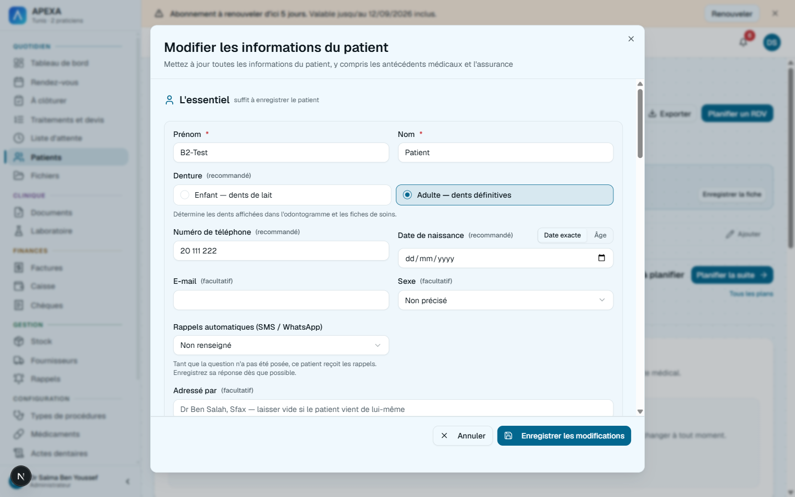
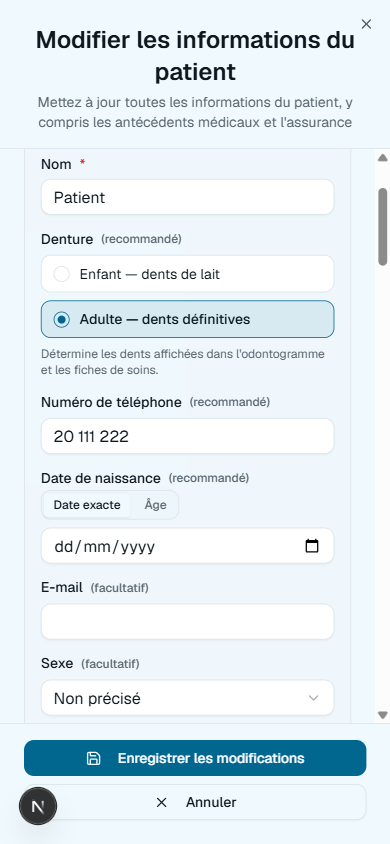
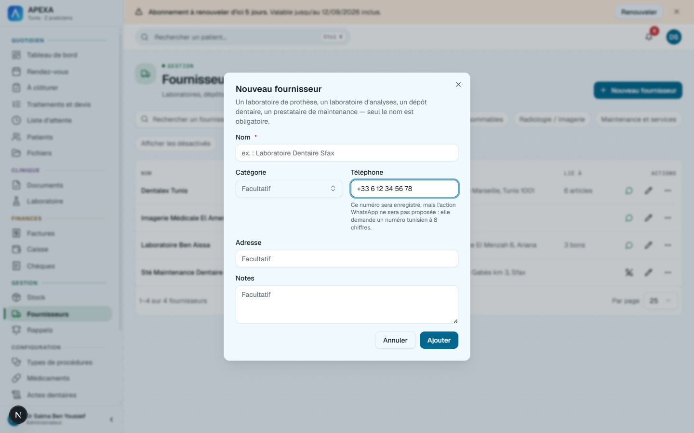
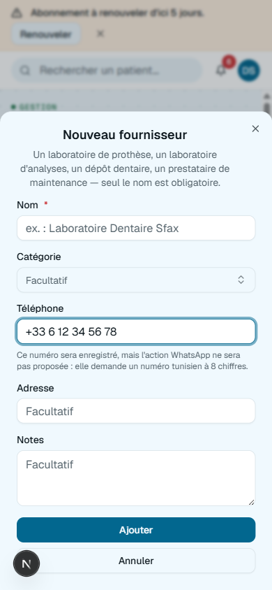
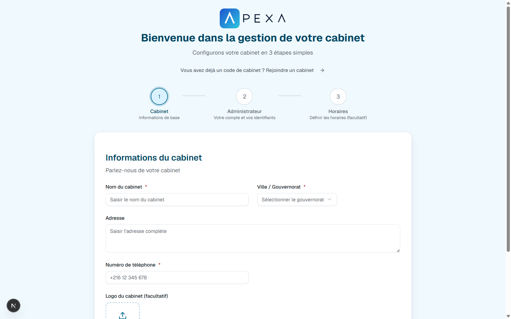

# Feature Specification: International phone numbers

**Status:** APPROVED
**Type:** Large (one rule, one new control, four entry points)
**Created:** 2026-09-07
**Scope:** `api/` (Domain + Application + Infrastructure) + `web/`. **No schema change** — see [Data / Schema Changes](#data--schema-changes).
**Feature:** A phone number belongs to a country the user chooses, and a patient abroad can be recorded and reminded like anyone else.

## Overview

A patient with a foreign number cannot be recorded. `PhoneNumber.ToE164`
(`api/ClinicManagement.Domain/ValueObjects/PhoneNumber.cs:38-55`) returns non-null only for eight Tunisian
digits, `IsDeliverable` is that predicate, and `PatientFromRequest.cs:41` refuses on it — so a Libyan patient, a
French retiree in Djerba and a Tunisian with an Italian mobile are all turned away at the fiche with « Utilisez un
numéro tunisien à 8 chiffres ». Meanwhile the *same* method decides whether a reminder is sent, whether two
records are the same person, and whether a WhatsApp action appears.

Three root causes, and only the first is the reported bug:

1. **The rule is single-country by construction.** `digits.Length == 8 ? "+216" + digits : null` cannot express
   any other country, and its browser mirror `web/lib/phone.ts:9-19` reimplements it line for line.
2. **One method answers three different questions** — may we store this, will we text it, and is this the same
   person. Widening it silently widens all three.
3. **The eight phone inputs already disagree**, and nothing records that they were meant to. Two refuse a foreign
   number (patient's own, the inline new-patient path); one accepts it with a note (`supplier-form-dialog.tsx:181`,
   verified live: « Ce numéro sera enregistré, mais l'action WhatsApp ne sera pas proposée »); five have no
   validation at all. A single uniform rule would *break* the supplier decision, which is deliberate and
   documented at `Supplier.cs:22-27` — « a dépôt with a French or Italian number is a real supplier ».

The industry answer to (1) is not "make the user type `+`": Google's libphonenumber requires a **default region**
to parse a number without one, and every app that does this well supplies that region from a country selector.
That is what this feature builds, for the four inputs that reach a human.

## What Changes

- `PhoneNumber.ToE164` parses through **libphonenumber** with a default region of `TN`, replacing the
  hand-rolled 8-digit rule. Any country is accepted; a bare national number still resolves as Tunisian.
- **`IsDeliverable` splits in name only, not in policy.** It keeps meaning « we can reach this number », and
  foreign numbers now satisfy it — so `ReminderScheduler.ReachabilityOfAsync` (`ReminderScheduler.cs:295-317`)
  makes a foreign patient reminder-eligible with no further edit. ⚠️ Deliberate, and it has a cost consequence
  recorded under [Out of Scope](#out-of-scope).
- A **country selector** joins the phone field on four surfaces: the patient's own phone
  (`edit-patient-dialog.tsx:1219`), the emergency contact (`:1569`), the inline new patient
  (`create-appointment-dialog.tsx:1123`), and the supplier (`supplier-form-dialog.tsx:173`).
- The refusal sentence gets **one owner per layer**. Backend: a `PhoneRefusals` class on
  `SubscriptionRefusals`' shape, read by `PatientFromRequest.cs:44`, `UpdatePatientCommand.cs:205` and
  `PatientImportRowReader.cs:147`. Frontend: `PHONE_ERROR_FR` already exists and already has two importers —
  the one straggler is the inline prose at `supplier-form-dialog.tsx:184`.
- The clinic's own phone, the per-doctor roster, and both wizard fields are **untouched**. They are clinic
  identity printed on documents, not numbers anything dials.

## Acceptance Criteria

**The rule**

- **AC-1:** `20123456`, `20 111 222`, `+216 20 123 456`, `0021620123456` and `216-20-123-456` all still return
  `+21620123456` — the six cases `ReminderPhoneTests.cs:9-15` pins today keep passing unchanged.
- **AC-2:** `+33 6 12 34 56 78`, `0033612345678`, `+1 415 555 2671` and `+218 91 234 5678` return their own
  E.164 and are accepted at every one of the four surfaces.
- **AC-3:** `201234567` (a Tunisian number with a ninth digit) is **refused**, because libphonenumber knows a
  Tunisian national number is eight digits. A length-only rule would have accepted it as Egyptian.
- **AC-4:** The default region is **one named constant per side**, and no other file states `"TN"` or `+216` as
  the fallback country.
- **AC-5:** The refusal names what to do without naming a country: « Numéro de téléphone invalide. Choisissez le
  pays, ou saisissez le numéro au format international (+33…). » One owner per layer, and the test that pins it
  **references the constant** — per `ExceptionMiddlewareTests.cs:20-24`, a retyped literal in an assertion counts
  as one of the copies.
- **AC-6:** The two sentences stay **two sentences with two roles**, not one string mirrored. The server's is the
  refusal; `PHONE_ERROR_FR` is a client-owned pre-check that saves a round trip, which is what
  `graceful-error-handling/spec.md:40` legitimises by scoping French to *frontend-owned* strings. Neither
  restates the other, and no `code → French` table is built — that spec considered one and deferred it
  (`:59`), and a `Result.Code` is added here **only** if a caller branches on it (`Result.cs:6-22`).

**The selector**

- **AC-7:** The selector is searchable and matches on French country name, ISO code and dial code — typing
  « France », « FR » or « 33 » all reach France, by joining all three into the cmdk `value` the way
  `supplier-picker.tsx:169-171` joins a supplier's category.
- **AC-8:** It renders **inline, never inside a `Popover`**. `act-catalog-picker.tsx:43-44` records why: nesting
  Radix `Command` in a `Popover` inside a `Dialog` gave three components a claim on Enter, and all four of these
  surfaces are dialogs.
- **AC-9:** Changing the country **never clears the typed number**, and changing the number never resets the
  country. Both are the same field's two halves.
- **AC-10:** Selecting a country does not raise the keyboard on a coarse pointer — the search box is not
  autofocused there, per `act-catalog-picker.tsx:59-72`.
- **AC-11:** A number pasted with a `+` **sets the selector** to the country it names, rather than leaving the
  selector disagreeing with the field beside it.
- **AC-12:** No flag glyph carries a fact alone — every row shows the country's name as text.

**The four surfaces, and their three different contracts**

- **AC-13:** The patient's own phone and the inline new-patient phone **refuse** an unparseable number, as today.
  ⚠️ `errors.phone` must clear on change: `edit-patient-dialog.tsx:1273-1278` clears only `birthdate` and
  `approximateAge` today, so a corrected number keeps its red border until the next submit — with a selector
  beside it that reads as a broken control.
- **AC-14:** The emergency contact keeps **accepting anything**. The selector is an aid, not a gate. Refusing
  here would reverse `PatientImportRowReader.cs:224-227`'s documented decision — a relative's number written
  « 71 555 (bureau) » must not cost the patient's record — and the field deliberately carries no `autoComplete`
  (`:1561-1563`) because it is somebody else's number.
- **AC-15:** The supplier keeps accepting anything, and its note now fires only for a genuinely unparseable
  number. A valid foreign number gets the WhatsApp action, so the note stops claiming WhatsApp « demande un
  numéro tunisien à 8 chiffres ».

**Reminders**

- **AC-16:** A patient with a foreign number is reminder-eligible and receives SMS and WhatsApp reminders.
- **AC-17:** Meta's country-, locale- and template-unsupported refusals are **classified as permanent**.
  `WhatsAppSender.Classify` (`:102-121`) handles six codes and that family is not among them, so a foreign
  refusal currently falls through to a generic transient failure, burns all three retries, and leaves its only
  diagnostic in the server log — `HttpReminderChannelSender.cs:15-21` keeps the response body off every screen
  by design.

**The mirror**

- **AC-18:** One committed corpus of `{ raw, expected }` pairs drives **both** implementations — the C# test and
  a `check:responsive` check read the same file. ⚠️ This is stronger than the repo's other mirror guards and is
  available only here: both sides are pure total functions of a string, which is exactly what
  `RealtimeResourceResolverTests` and `OdontogramConditionMirrorTests` could not do. It fails on a parsed count
  of zero, carries an empty both-directions exemption map, and ships with an executed red proof.
- **AC-19:** Exactly one file in `web/` decides what a valid phone is — on `monochrome1-has-one-owner`'s shape,
  derived not listed, naming the other offenders when it fails. It catches `supplier-form-dialog.tsx:184` today.
- **AC-20:** The import gains its first test file. `PatientImportRowReader`, `PatientImportPlanner`,
  `PatientImportFields` and `PatientImportMapping` are covered by **nothing** today, and this change touches the
  phone path in two of them.

## API Contract

No new or removed endpoints. Two response shapes change meaning, neither in structure:

### `GET /api/patients` · `GET /api/patients/{id}` — `PatientDto.phoneE164` *(modified)*
Now non-null for a foreign number. ⚠️ This is what decides whether a WhatsApp action exists on a patient row
(`PatientDto.cs:34-43`), so five read-only surfaces gain the action for free — `patients-table.tsx:484,611`,
`stock-table.tsx:608`, `notification-panel.tsx:263`, `app/lab-orders/page.tsx:1002,1163`.

### `POST /api/patients` · `PUT /api/patients/{id}` *(modified)*
Errors: `400` with the AC-5 sentence, for a number no country can parse. A foreign number is no longer a `400`.

### `POST /api/patients/import/preview` · `POST /api/patients/import` *(modified)*
A row whose phone was previously `Invalid` may now read `Ready` — **or `Duplicate`**, see EC-1.

## Data / Schema Changes

None. `Patient.PhoneNumber` stores the raw trimmed string and `PhoneE164` is derived at DTO-mapping time
(`PatientMappingExtensions.cs:53`), so existing rows reinterpret for free with no migration and no backfill.
`Address.Country` stays the write-once `"Tunisia"` literal it already is (`edit-patient-dialog.tsx:755`) — this
feature does not read it, and does not add a clinic country column.

## Device Behaviour

**Leading device:** tablet at the chair, then desk. The phone is the *roomiest* case here, which is the opposite
of the usual assumption and is measured, not assumed.

| Surface | Phone (< 640) | Tablet portrait (640–1023) | Desktop |
|---|---|---|---|
| Patient phone + emergency contact | 294 px field in a `mobile="sheet"` dialog, one column. Selector is a full-width row above the number. | Two columns return; selector inline. | 391 px field, 2-col grid in an 879 px dialog. |
| Inline new patient | Same sheet, `h-10` field. | Same. | Selector inline beside the number. |
| Supplier | **342 px** — grid collapses, so more room than desktop. | Same single column. | ⚠️ **223 px, the binding constraint**: a 2-col grid in a 512 px dialog, where today's « l'action WhatsApp ne sera pas proposée » note already wraps to four lines. The selector cannot be a fixed-width control here. |

- **Touch paths:** selector rows are a **stack**, so they grow (`coarse:py-3`), never `.touch-target` — a 44 px
  overlay on a 32 px row overhangs its neighbours and the later sibling steals the tap
  (`frontend-web.md` § 2, and `act-catalog-picker.tsx:170-183` for the measured version).
- The number field keeps `text-base md:text-sm`, `bg-card` and its `h-9`. No 44 px class is added to it —
  `globals.css` already floors every `input` under `(pointer: coarse)`, and § 2 says do not re-add it.
- The selector trigger sits beside the field, so it **grows** (`coarse:size-11`-style) rather than overlaying.
- Any height cap on the list is written in `dvh`, never `vh` (`sheet-vh` fails on any `vh` inside a height).
- The « no country matches » line goes through `quoteFr()` — `french-quote-binding` fails on `« ${x} »`, and at
  320 px an unbound guillemet lands alone on its own line.
- **Named exceptions:** none. All four surfaces keep every capability at every width.

## Out of Scope

- **Per-country reminder cost.** Foreign WhatsApp reminders consume the same flat allowance
  (`ClinicMessagingMonth.RecordSend` → `ConsumedMessages++`, no destination parameter) while Meta bills by
  destination country, so the counter stops approximating the vendor's real spend. `MessagingAllowanceEntry`
  has `int Messages` and no currency, unit price or country field. Accepted deliberately for this feature;
  capture as a follow-up before foreign patients are common.
- **Reminder template localisation.** `Reminders:WhatsApp:TemplateLanguage` is `fr` per install, so a foreign
  patient receives a French reminder. Correct for a Tunisian practice's foreign residents; wrong for a genuinely
  international list. Not this feature.
- **A clinic country setting.** Every clinic is Tunisian, the governorate list is 24 Tunisian names and the tax
  settings are Tunisian. AC-4 puts the fallback in one place so adding the setting later is a small change.
- **The other four phone inputs** — clinic's own phone (`clinic-settings.tsx:815`, and the same value again at
  `setup-wizard.tsx:619`), the per-doctor roster (`:1056`), the join wizard (`join-wizard.tsx:407`). Identity,
  not contact. ⚠️ The doctors endpoint also **deletes any doctor not echoed back** and carries no `version`,
  making it the riskiest form in the app to touch for an unrelated reason.
- **`setup-wizard.tsx:895`'s practitioner phone is dead UI** — reachable only when `!isLocalMode`, and
  `AuthMode` has one value, so the branch never renders. Flag for deletion with the retired cloud branch, not here.
- **Export format.** `ExportTables.cs:49` writes the raw stored value, not `PhoneE164`. A wider accept set cannot
  reject what a narrower one accepted, so the round trip stays safe and this stays as it is.
- **E2E tests**, per the pipeline's own sequencing.

## Edge Cases (Critical only)

### EC-1: A widened rule creates duplicates that did not exist
- **Scenario:** Two patients both hold the same French number. Today both fold to `null` in
  `PatientDuplicateIndex` (`:119-125` — an unparseable phone is simply not indexed), so they have never matched.
  After this change they share a key.
- **Expected:** They match as `Kind.Phone`. On the import path a duplicate is **not created by default**
  (`ImportPatientsCommand.cs:103-109`), so rows that previously imported cleanly may now be skipped. This is
  correct — two fiches for one person cannot be merged afterwards — but it must reach the operator through the
  existing « Créer quand même » affordance, never silently. The intra-file case behaves identically
  (`PatientImportPlanner.cs:101-107`).

### EC-2: A number that is valid for no country
- **Scenario:** `« 71 555 (bureau) »`, `+999 123`, `abc`.
- **Expected:** Refused at the patient's own phone and the inline new-patient path with AC-5's sentence; stored
  as typed at the emergency contact and the supplier. Three contracts, deliberately (AC-13/14/15).

### EC-3: A country the selector offers but Meta will not deliver to
- **Scenario:** A reminder is queued for a country outside the WhatsApp template's approval.
- **Expected:** Classified permanent (AC-17), one attempt, and a `ReminderFailed` staff notification —
  not three retries whose reason exists only in the server log.

### EC-4: An eight-digit number that is also valid elsewhere
- **Scenario:** The user has France selected and types `20123456`.
- **Expected:** Parsed against **France**, not Tunisia, and refused if France has no such number. The selector is
  the answer to « which country », and the `TN` constant is only the fallback when the user has not said.

## Screenshots

Current state, captured 2026-09-07 before any change:

- 
- 
- 
- 
- 
