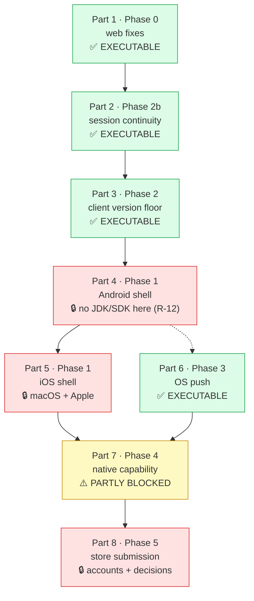

# The clinic on a phone — native Android & iOS shells · Implementation Stories

**Status:** APPROVED
**Plan:** [../plan.md](../plan.md) (APPROVED)
**Spec:** [../spec.md](../spec.md) (Challenged: Yes — AC-1 … AC-77)
**Blueprint:** [../blueprint.md](../blueprint.md) — ⚠️ superseded where it disagrees with the spec

## Summary

Two thin native shells (Kotlin/`WebView`, Swift/`WKWebView`) in a new top-level `mobile/`, each rendering the hosted
server's **own** web bundle — plus the web-side fixes a webview makes load-bearing, a client-version floor, sliding
session expiry, OS push, and two store listings.

**This breakdown is one story, deliberately.** `plan.md` encodes that decision (risk **R-1**) and `/break-plan` was
invoked with `one us`, so it is materialized as written rather than re-opened.

> ⚠️ **Departure from the single-layer (BE/FE) rule, stated rather than implied.** The one story is
> `Layer: Full` — it spans assets, domain, API, BFF, web client, two native toolchains, docs and store operations.
> Its **eight ordered parts** carry the internal structure the layer split would otherwise provide: each part is a
> *vertical* increment that compiles, passes its own gate and is independently shippable, and **each part boundary is
> a commit point**. If a session runs out, split at a boundary — never inside a part.

**No test plans exist** for this feature (`test-plan-e2e.md` / `test-plan-api.md` / `test-plan-integration.md` are
absent), so verification cites the spec's acceptance criteria and the repo's own gates directly rather than scenario
numbers. For `web/` that gate is `check:responsive` + `tsc --noEmit` + `build` + a recorded eye pass — there is no FE
test runner, no working ESLint and no CI.

## Part order

One story, so there are no story dependencies. The graph that matters is the story's **internal part order** —
each part is a vertical increment and each boundary is a commit point:

⚠️ **Part 3 → Part 4 is a real edge, not just ordering:** the Android shell reads
`GET /api/meta/client-requirements` natively at launch, so Part 3's endpoint must exist first.
**Part 7 needs both** Part 5 (its iOS halves) and Part 6 (a notification to tap for the deep-link criterion), which
is why it sits downstream of the two blocked parts even though its web and Android halves are executable.

⚠️ **Part 4 → Part 6 is drawn dotted because it is not a build dependency.** Push needs a shell to *register a
device token*, so the two must meet before AC-40 can be demonstrated end to end — but Part 6's whole backend half
(the `PushDevice` aggregate, registration, `PushDispatchJob`, quiet hours, the tenant declaration, `verify-schema`)
compiles and is testable with no shell in existence. With Part 4 blocked on tooling as of 2026-08-05, **Part 6 is
the next executable part**, and the token-registration criteria are what it leaves owed.

## Status Tracker

**One story: [`story-1-full-clinic-on-a-phone.md`](./story-1-full-clinic-on-a-phone.md)** — `Layer: Full`, depends on
nothing, blocks nothing. There is no second story and no story-level dependency graph to draw.

### Part tracker (plan-time view)

The unit of progress is the **part**, not the story. This table is the plan-time snapshot; once implementation
starts, **`progress.md` carries the authoritative live part-status table** plus a per-part session log — the
convention `/next` defines for a single `Layer: Full` story delivered part-by-part, where every part shares one
`spec.md` / `plan.md` / `stories/` / `progress.md` and nothing is archived per part.

| Part | Slice | Name | Executable here? | ACs | Status |
|------|-------|------|------------------|-----|--------|
| 1 | Phase 0 | The web fixes a webview makes load-bearing | ✅ yes | AC-1…AC-12, AC-69 | **implemented** (gate green; on-device checks owed — `progress.md`) |
| 2 | Phase 2b | The session lasts the working day | ✅ yes | AC-35…AC-39 | **implemented** (gate green; the felt behaviour + desktop shell owed — `progress.md`) |
| 3 | Phase 2 | A stale app says so | ✅ yes | AC-28…AC-34, AC-70, AC-71 | **implemented** (gate green; AC-33's launch half is Part 4's code — `progress.md`) |
| 4 | Phase 1 | The Android shell | 🔒 **no — the R-12 check ran and failed** (2026-08-05) | AC-13…AC-27, AC-74, AC-76 | blocked on tooling |
| 5 | Phase 1 | The iOS shell | 🔒 **BLOCKED** — macOS + Apple Developer Program | AC-13…AC-27 (iOS half) | blocked |
| 6 | Phase 3 | A backgrounded phone still knows | ✅ yes | AC-40…AC-55, AC-70…AC-73, AC-75 | **implemented** (web + backend gates green; the backend suite re-run, both console verbs and every device-token criterion owed — `progress.md`) |
| 7 | Phase 4 | The phone becomes an instrument | ⚠️ web + Android halves only | AC-8, AC-56…AC-64, AC-77 | not-started |
| 8 | Phase 5 | Two store listings | 🔒 **BLOCKED** — accounts + 4 deferred decisions | AC-65…AC-68 | blocked |

**Suggested first session: Part 1.** It depends on nothing — no hosted origin, no accounts, no Mac, none of the four
deferred business decisions — and it fixes four defects live in the browser today (iOS Safari downloads that silently
deliver nothing, blank PDF previews, printing the sidebar, a dead mic button on every iPhone).

> ### ⚠️ A dependency moved during this breakdown — verified in code, 2026-08-05
>
> `multi-tenant-cloud` **US-1 has landed**: `Infrastructure/Deployment/DeploymentProfile.cs` exists with **13
> capabilities**, `DeploymentProfileCoverageTests` and `DeploymentProfileTests` are both live, and `IsLocalMode(`
> survives only in its own definition, in `Resolve`'s back-compat derivation, and in one test. **US-2 has not**
> (no `ITenantScope`, no `SystemWideCallerCoverageTests`). Three effects:
>
> - **Part 6's blocker narrowed** from US-1 + US-2 to **US-2 alone**.
> - **AC-70's guard is live**, so Part 3 must ask a named capability — a new `IsLocalMode(` **fails the build today**.
> - **Part 7's connectivity work lost its API half and gained urgency.** `ConnectivityController:40` already gates on
>   `ExposesTrustEndpoints`, which is **✗ for `HostedMultiTenant`** — so the probe 404s there while
>   `connectivity.tsx` still polls on `AUTH_MODE === 'local'`. The defect the challenge predicted is **live in code**;
>   the remaining fix is web-side only.
>
> Re-verify both before starting Part 6 — they move on their own schedule, not this feature's.

## Blocked parts — what unblocks each

| Part | Blocked on | Who can unblock it |
|------|-----------|--------------------|
| 4 | A JDK + Android SDK on the build machine | ✅ **Checked 2026-08-05 (session 3) — absent.** No `java` on `PATH`, `JAVA_HOME` unset, `ANDROID_HOME`/`ANDROID_SDK_ROOT` unset, nothing at `%LOCALAPPDATA%\Android\Sdk`, no `gradle`. **Anyone with the build machine can unblock this** by installing JDK 17+ and the Android SDK (cmdline-tools + platform + build-tools) — unlike Part 5, no purchase and no other OS is involved |
| 5 | macOS + Xcode (or Xcode Cloud / Codemagic) **and** an Apple Developer Program membership | Not solvable in this repo: win32, no CI, and the project **has never had an iOS device** |
| ~~6~~ | ~~`features/multi-tenant-cloud` **US-2** (`ITenantScope`) merged~~ | ✅ **UNBLOCKED, verified 2026-08-05 (session 2)** — `Application/Common/Interfaces/ITenantScope.cs` and `UnitTests/Common/SystemWideCallerCoverageTests.cs` both exist and the suite is green. Part 6's `PushDispatchJob` must declare `UseSystemWide(...)` or that guard fails the build |
| 8 | Store accounts + a public domain a reviewer can reach + the four deferred decisions (hosted domain · bundle ids and display name · demo-tenant data policy · store-account ownership) | Business/ops. ⚠️ A bundle identifier **cannot be changed after first submission** |
