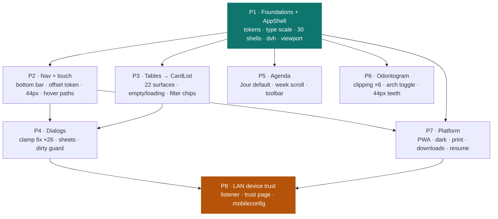

# Mobile & tablet — Implementation Stories

**Plan:** [../plan.md](../plan.md) · **Spec:** [../spec.md](../spec.md) · **Exploration:** [../exploration.md](../exploration.md)

## Summary

Finish the responsive pass that `audit-sections-3-to-10` US-P3b deliberately stopped short of — the wide data
tables, the agenda grid, the 70 modal surfaces, the odontogram and the tablet range — and take the result to a
native-app standard: coarse-pointer touch targets, sheets instead of squeezed modals, one owner for the bottom
edge, home-screen install, a reachable dark mode, a print stylesheet, and a way for a phone to trust a LAN install.

## Story count: one, by explicit decision

`plan.md` already encodes **one story worked in eight ordered parts** (settled during `/plan-feature`, recorded as
risk **R-1**), and `/break-plan` was invoked with *"the fewest amount of user stories possible"*. Granularity was
therefore **not re-opened** — this folder materializes exactly that decision.

Two consequences worth stating plainly:

- The story is **`Layer: Full`**, departing from the skill's default BE/FE split. Seven of the eight parts are
  frontend-only; only **P8** touches the API and packaging. Splitting on layer would have produced a 7:1 split
  that reflects nothing real about the work.
- **Test authoring is out of scope for this story, by explicit instruction** — implementation only. This is a
  decision, not an omission. It costs little here: `web/` has no test runner, no working ESLint and no CI, so the
  spec's verification strategy was already a mechanical script plus a documented manual walk rather than tests.
  ⚠️ One exception that is *not* a test: **P8 must add its new anonymous endpoints to
  `ControllerAuthorizationCoverageTests.ExpectedAnonymous`** — that guard pins the set by equality, so the build
  breaks until it is updated. That is implementation work.

## Part dependencies

The story's eight parts, and what genuinely blocks what. **A part boundary is the commit point and the resume
point.**

**Why those edges, and not others:**

- **P1 blocks everything.** Every later part edits the shell or a primitive P1 creates.
- **P2 → P4 and P2 → P7.** P2 defines the single bottom-offset token; the bottom sheets, the toasts and the AI
  panel all consume it. Defining it twice is how they drift.
- **P3 → P4.** `patient-summary-modal` is a card conversion *inside* a dialog — the same file P4 rewrites, and the
  one that is clipped rather than scrollable today.
- **P8 last.** AC-46 needs a physical iPhone and Android tablet; nothing here substitutes. Sequenced last so the
  other seven never block on device access.
- **P5 and P6 are independent** of P2/P3/P4 and of each other. Either may be reordered.

## Status tracker

| Story | Layer | Name | Status | Depends On |
|-------|-------|------|--------|------------|
| 1 | Full | [The app works, and looks finished, on every device](./story-1-mobile-tablet-responsive.md) | in-progress | — |

### Part progress

| Part | Covers | Spec ACs | Status |
|------|--------|----------|--------|
| **P0** | Mechanical-check script (written first, see story note) | AC-50 | ✅ complete (`920571a`) |
| **P1** | Foundations + `AppShell` | AC-1…AC-6, AC-36 (viewport) | ✅ complete (`de07bfb`) |
| **P2** | Nav, touch, bottom token | AC-7…AC-12 | **next** |
| **P3** | Tables → `CardList` | AC-13…AC-19 | not-started |
| **P4** | Dialogs | AC-20…AC-27 | not-started |
| **P5** | Agenda | AC-28…AC-31 | not-started |
| **P6** | Odontogram | AC-32…AC-35 | not-started |
| **P7** | Platform | AC-36…AC-43 | not-started |
| **P8** | LAN device trust | AC-44…AC-46 | not-started |
| — | Cross-cutting | AC-47…AC-51 | continuous |

Resume state lives in [progress.md](./progress.md).
