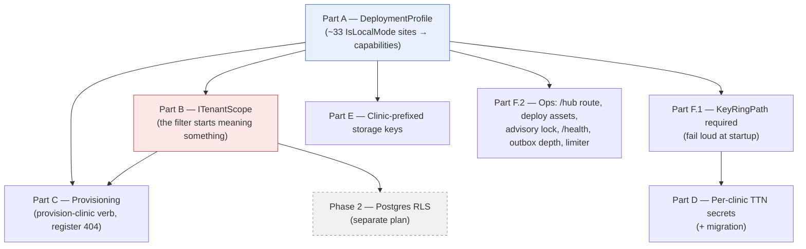

# Multi-Tenant Cloud — Implementation Stories

**Status:** APPROVED
**Plan:** [../plan.md](../plan.md) — Status **APPROVED**, Challenged **Yes** (two passes)
**Spec:** none — ⚠️ the plan was authored directly from the challenged Option A and says so. There are **no
acceptance criteria to verify against**; per the plan's **R-3**, write a `spec.md` if scope grows beyond parts A–B.
**Branch:** `feature/audit-sections-3-to-10` (by decision — see the story's entry criteria)

## Summary

Turn the product into a hosted multi-tenant service: each clinic installs the **existing** Windows desktop client,
all data lives in one hosted backend, and it is safe for an arbitrary number of clinics.

Three topologies exist in the code's design space; two are built:

| | Front door | Data | Login | Built? |
|---|---|---|---|---|
| `SelfHostedLan` | Kestrel + YARP on the clinic's own PC | that PC | own JWT | ✅ |
| `CloudBrowser` | Caddy → Next + API | hosted | Auth0 | ✅ (`cloud-deployment`) |
| **`HostedMultiTenant`** | **Caddy → Next + API** | **hosted** | **own JWT** | ❌ **this work** |

The third is not new infrastructure — it is **the second deployment's infrastructure with the first's
authentication**. What actually gets built is two things: `LocalAuthConfig.IsLocalMode`, one boolean answering ten
unrelated questions across 33 call sites, becomes a resolved **deployment profile** with a capability per question;
and the EF Core global query filter — **fail-open, therefore inert today** — starts refusing when no tenant scope
was ever set.

## Why one story

**Requested granularity: a single full-stack story** — and **reconsidered once, then confirmed**. A six-way split
matching the plan's US-1…US-6, a three-way split (profile / tenant scope / the rest) and a two-way split (A+B, then
C–F) were all put on the table with their file counts; the single story was kept deliberately. **This is settled —
do not re-open it.** Recorded here so it is not silently undone:

- The `DeploymentProfile` type (part A) is a **compile-time** dependency of the tenant-scope middleware (B) and of
  the capability branches in C, D, E and F.
- Part F's `KeyRingPath` requirement **must** land before part D, or a rotated key silently breaks e-invoice
  signing for every clinic.
- All parts share one migration-and-verify cycle (`verify-schema` before/after, diffed).

Split into six, the intermediate states are not independently deployable — which is the property a story split is
supposed to buy. ⚠️ This story is therefore a **deliberate departure** from the BE/FE separation rule
(`Layer: Full`): a backend-only story could not be exercised (no login path) and the frontend story would be two
one-line diffs.

## Story Dependencies

One story, six ordered internal parts. The ordering is load-bearing, not cosmetic:

- **A → B** — the filter and the scope middleware both branch on the resolved profile.
- **F.1 → D** — storing a PFX password protected by Data Protection makes e-invoicing depend on the key ring.
- **B → C** — `provision-clinic` runs with no HTTP context and must call `UseClinic(created.Id)`; writing it before
  the scope exists means writing it twice.

## Status Tracker

| Story | Layer | Name | Status | Depends On |
|-------|-------|------|--------|------------|
| 1 | Full | [Hosted multi-tenant profile](story-1-full-hosted-multi-tenant.md) | in-progress — **Part A implemented** | — |

### Internal parts (the resumable unit)

⚠️ 18 steps and ~35 files will **not** fit one session. Treat a **part** as the checkpoint: commit at each
boundary and keep `../progress.md` current so a fresh session can resume mid-story.

| Part | Plan | What it delivers | Steps |
|------|------|------------------|-------|
| A | US-1 | `DeploymentProfile` + capabilities; `IsLocalMode` retired from all call sites | 1–4 |
| B | US-2 | `ITenantScope`; the filter refuses on `Unset` — **the plan's whole security thesis** | 5–10 |
| C | US-3 | `provision-clinic`; self-registration closed; admin-created staff accounts | 11–13 |
| D | US-4 | Per-clinic TTN identity (+ migration) | 14 |
| E | US-5 | `clinics/{clinicId}/…` keys, old flat keys still resolve | 15 |
| F | US-6 | `/hub/*` route, hosted deploy assets, advisory lock, `/health`, outbox depth, limiter, docs | 16–18 |

**A and B alone are the security thesis.** D, E and F.2 are additive and could be dropped without invalidating
A–C — useful if the session budget runs out.

## Two exit gates

Roughly half this work cannot be verified in this repo: **no database in the test project**, **no test runner in
`web/`**, `verify-schema` needs a live DB, and the `/hub/*` route plus the five deploy keys are only observable on
a real hosted deploy. So the story has two gates:

| Gate | Runnable here? | Reaches |
|---|---|---|
| **Code gate** — build 0/0, four new/extended test classes, `tsc` + `check:responsive` + `build` | yes | `implemented` |
| **Operator gate** — `verify-schema`/`reconcile-money` before+after diffed, two-clinic isolation, two-browser live refresh, reminder + email dispatch, hosted login | no | `done` |

⚠️ **Smart App Control** (`0x800711C7`) blocks the test runner intermittently on this machine. A red run is **not
evidence** until `bin/` + `obj/` are cleared and `dotnet build-server shutdown` has run.

⚠️ **R-6 — this profile's failure modes are overwhelmingly silent, and they live in deploy assets no test can
reach.** A missing `/hub/*` route kills realtime behind a bare `catch {}`; a missing `API_INTERNAL_URL` 500s only
on login; a key ring with no volume works until the first redeploy. The enumerated key table in the story and the
two-browser check are the whole defence.

## Out of scope

**Phase 2 — Postgres RLS**, a separate plan, with its three traps named (a table owner *bypasses* RLS without
`FORCE ROW LEVEL SECURITY`; a bare `SET` leaks the tenant to the next request on a pooled connection; migrations,
jobs and verbs need a bypass path).

**Five owed decisions**, none of which touches the tenancy seam: offline behaviour · per-clinic backup/restore ·
client auto-update + API version compatibility · HuggingFace PHI · compliance (INPDP declaration under loi
2004-63, a DPA per clinic, residency, retention).
