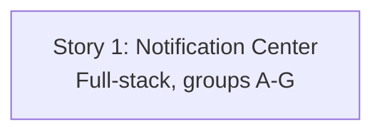

# Stories: In-App Staff Notification Center

**Plan:** [../plan.md](../plan.md) · **Spec:** [../spec.md](../spec.md)

This feature is delivered as **one full-stack vertical story** per the planning decision (`plan.md` Type: single implementation story). `/break-plan` was intentionally skipped; the single story wraps the plan's US-1 and is implemented as ordered step-groups A–G, each leaving the build green and checkpointed in `progress.md`.

## Stories

| # | Story | Layer | Status | Depends On |
|---|-------|-------|--------|------------|
| 1 | [In-App Staff Notification Center](story-1-notification-center.md) | Full | implemented | None |

## Dependency Diagram

## Notes

- All design decisions, the full file list, and the risk register live in [../plan.md](../plan.md) — the story file references it rather than duplicating it.
- Step-groups A–G are implemented in order; each is a checkpoint boundary in `progress.md`.
