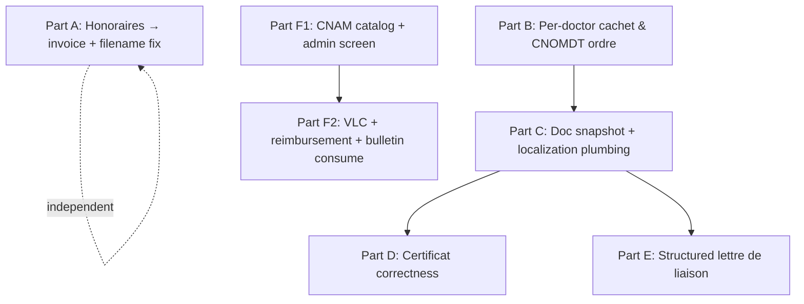

# Official Documents — Production-Ready — Implementation Stories

**Plan:** [../plan.md](../plan.md) (APPROVED, Challenged: Yes)
**Spec:** [../spec.md](../spec.md) (APPROVED, Challenged: Yes)
**Design:** [../design.md](../design.md) (APPROVED) · **Tests:** [../test-plan-integration.md](../test-plan-integration.md) (APPROVED)

## Summary

Make `/documents` legally/fiscally correct for a Tunisian dental cabinet, reusing existing pipelines (Invoice, image-upload, `ProcedureType` CRUD template). Per the user's decision this ships as **one full-stack story** (`Layer: Full`) rather than a BE/FE or per-part split. The single story is organized into **six ordered, dependency-respecting internal parts (A–F)**, each a vertical increment (DB → service → API → UI); `/implement-story` lands and commits **part-by-part**, using the part boundary as the natural split point if a session can't hold all six.

> **Departure from the single-layer rule (deliberate):** `/break-plan`'s default is one story per layer (BE/FE). The user explicitly chose a single full-stack story, so this story is `Layer: Full` with steps grouped by part/slice. Parts A–F are **vertical** increments, not layer dumps.

## Story Dependencies (internal parts of the single story)

- **A** and the **F1→F2** chain are independent of the **B→C→D/E** chain — implementable in any relative order.
- Within B→C→D/E: cachet fields (B) precede the document snapshot/render plumbing (C), which precedes the certificat (D) and liaison (E) render work.

## Status Tracker

| Story | Layer | Name | Status | Depends On |
|-------|-------|------|--------|------------|
| 1 | Full | Official documents production-ready (parts A–F) | implemented (Parts A–F implemented) | - |

## Internal part order (for `/implement-story`)

| Part | Delivers | Depends on |
|------|----------|-----------|
| A | Compliant honoraires via invoice pipeline + `bulletin-cnam` update filename fix | — |
| B | Per-doctor cachet image + CNOMDT ordre number (own-or-admin) + Mon profil | — |
| C | Cachet/ordre/city snapshot into `ContentJson`; "Paris"→city; cachet render; non-editable preview | B |
| D | Certificat objet/motif + optional repos + mention + CNOMDT label (no data loss) | C |
| E | Structured lettre de liaison to an external confrère | C |
| F1 | Global DB-backed CNAM catalog + admin screen (AdminOnly CRUD, provisional flag) | — |
| F2 | VLC values + backend age-based reimbursement + bulletin editor consumes DB catalog | F1 |
