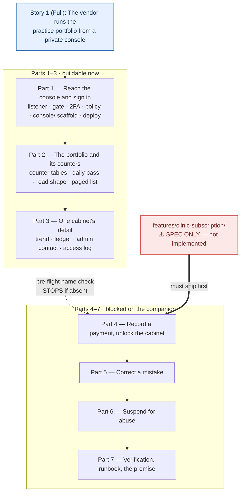

# Console éditeur (vendor back-office) — Implementation Stories

**Status:** APPROVED
**Plan:** [../plan.md](../plan.md)
**Spec:** [../spec.md](../spec.md)
**Depends on:** [`features/clinic-subscription/`](../../clinic-subscription/spec.md) — Parts 4–7 only
**Branch:** `feature/platform-console`, **local only** — no remote, nothing pushed
**Worktree:** `.claude/worktrees/platform-console/` — the main checkout stays on its own branch
**Progress:** [progress.md](./progress.md) — gate results, deviations, and what is owed

> ⚠️ **The work is not on the branch you are probably standing on.** It was branched from `50b6f1c` into the
> worktree above because a **second session was writing `features/clinic-subscription/` into the main working
> tree at the same time** — that tree did not compile, so no gate could be run, and five files are needed by both
> features. `progress.md` lists the merge points; all of them are mechanical.
>
> ⚠️ **The companion's status has moved and this line used to overstate it.** It is no longer « spec only »: it
> is being implemented right now, in the main tree, uncommitted. From *this* branch it is still absent — that is
> why Parts 4–7 remain blocked here — but « nobody has started it » is no longer true and should not be planned
> around.

## Summary

A private back-office where the vendor sees how much each cabinet actually uses the product and unlocks a
cabinet the moment its transfer lands — without ever being able to read a patient record. It is a **fourth
surface** on an existing product: a second identity population (its own accounts, its own tokens, a mandatory
second factor), a second Kestrel listener on an unpublished port reached over a tunnel, a second Next
application (`console/`), and exactly one narrow cross-cabinet read whose returned shape is closed and held by
a derived check that fails the build.

## Story breakdown — one story, seven ordered parts

**This feature is deliberately a single story.** The user asked for one; `plan.md` honours that (US-1) and
records the oversize as **R-1** rather than re-litigating it. `/break-plan` materialises that decision as it
stands: **one story file, `Layer: Full`, whose steps are grouped by the plan's seven parts.**

> ⚠️ **Two departures from `/break-plan`'s defaults, both deliberate and both recorded here.**
>
> 1. **The BE/FE separation rule is overridden.** This story spans Domain, Application, Infrastructure, API,
>    Hangfire, deploy assets **and** a brand-new Next application. It is `Layer: Full` and its steps are ordered
>    by *part* (a vertical increment each) rather than by layer, so the internal sequencing stays legible.
> 2. **The sizing guidelines are exceeded knowingly** — far past 3–7 steps and 2–8 files. Each part is a natural
>    commit boundary and a resumption point, which is the mitigation R-1 states.

### The one thing to know before starting

Parts **1–3** are buildable today. Parts **4–7** are **blocked**: they delegate to
`features/clinic-subscription/`, which is a spec with **no implementation** — verified at challenge time (no
plan file, and zero hits in `api/` for `ClinicSubscription`, `SubscriptionPeriod`,
`GrantSubscriptionPeriodCommand` or `SuspendClinicCommand`). Part 4 therefore opens with a **pre-flight name
check** and **stops** if any assumed name is absent; it does not improvise a console-side entitlement fold,
which would be the FR-4 violation this feature is defined around.

So this story reaches `implemented` for Parts 1–3 and then **waits**. That is a known and accepted property of
materialising the plan as one story rather than two slices.

## Story Dependencies

## Status Tracker

| Story | Layer | Name | Status | Depends On |
|-------|-------|------|--------|------------|
| 1 | Full | [The vendor runs the practice portfolio from a private console](./story-1-full-platform-console.md) | **implemented** (all 7 parts) | `features/clinic-subscription/` — **fully merged at `0b97d09`** (Parts A–G + the review pass) |

### Part-level progress (within Story 1)

The story's own commit boundaries. Tick a part when its validation checklist passes.

| Part | Increment | Blocked? | Status |
|------|-----------|----------|--------|
| 1 | Reach the console and sign in | No | **implemented** |
| 2 | The portfolio, and the counters behind it | No | **implemented** |
| 3 | One cabinet's detail | No | **implemented** |
| 4 | Record a payment and unlock the cabinet | No — merged at `25b252d` | **implemented** |
| 5 | Correct a mistake | No — merged at `25b252d` | **implemented** |
| 6 | Suspend for abuse | No — merged at `25b252d` | **implemented** |
| 7 | Verification, operator runbook and the promise | No | **implemented** |

## Gates this story is held to

There is no test runner in `console/` (as there is none in `web/`), and the backend unit suite is the **only**
automated check the API has. So the gate is:

| Gate | Command | Covers |
|------|---------|--------|
| Backend unit suite | `dotnet test` (build to a path outside the repo — see Notes) | Every derived check and every pure predicate |
| Schema | `dotnet run -- verify-schema` before/after the migration, diffed | The migration — the one class of change unit tests structurally cannot see |
| Console typecheck | `npx tsc --noEmit` in `console/` | — |
| Console responsive gate | `npm run check:responsive` in `console/` | The device contract |
| Console build | `npm run build` in `console/` | — |
| CI | the new fifth `console` job | The three above, on every push |
| Eye pass | 320 / 390 / 820 / 1180 / 1440 px | Login, list, detail, journal, payment sheet, both confirmations |
