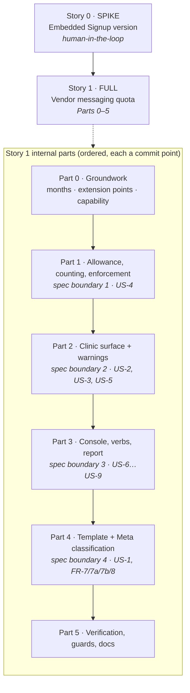

# Forfait de rappels WhatsApp (vendor-purchased messaging quota) — Implementation Stories

**Status:** APPROVED
**Plan:** [../plan.md](../plan.md) (APPROVED, challenged)
**Spec:** [../spec.md](../spec.md) (APPROVED, challenged)
**Exploration:** [../exploration.md](../exploration.md)

## Summary

The vendor buys WhatsApp messaging capacity centrally and allocates each cabinet a **monthly allowance of reminder
messages** — visible to the practice, adjustable by the vendor, counted as it is spent, and enforced when it runs out.
Enforcement is gentle: an exhausted cabinet's reminders are **held**, not failed, and go out by themselves at the start
of the next Tunisian month or the moment the vendor grants more. Everything else — the agenda, the records, SMS
reminders — is untouched.

Available on **`HostedMultiTenant` only**, through the 18th `DeploymentProfile` capability `SellsVendorMessaging`.
On the other two deployment kinds every surface is **absent**, not present-and-refusing (EC-16).

## ⚠️ Deliberate departure from the BE/FE separation rule

`/break-plan` normally splits every story into a single layer. **Story 1 is `Layer: Full`**, carrying backend, jobs,
console verbs, clinic UI and console UI together. This is not an oversight — it is the granularity decision already
settled in `plan.md` (see its Overview and **R-1**, which registers the oversize as a High-likelihood risk and names
the split point). Its steps are grouped by the plan's own **six ordered parts**, each a vertical increment and each a
commit point, so the internal ordering stays legible and `/implement-story` can land part by part across sessions.

**If Story 1 needs splitting later, split at a part boundary.** The parts are dependency-ordered and no part reaches
backwards. The natural cut is **Parts 0–1 · Part 2 · Part 3 · Parts 4–5**, and R-2's contingency already notes that
**Part 4 can split off on its own** — Parts 1–3 do not depend on it, since enforcement, counting and the console all
work on the existing WhatsApp connection.

## Story Dependencies

## Status Tracker

| Story | Layer | Name | Status | Depends On | Blocks |
|-------|-------|------|--------|------------|--------|
| 0 | Spike | Embedded Signup version confirmation | **done** ✅ | – | 1 |
| 1 | **Full** | Vendor-purchased WhatsApp messaging quota | **in-progress** — Parts 0 ✅ · 1 ✅ · 2 ✅ · 3–5 ⬜ | 0 | – |

> **Parts 0 and 1 landed on `feature/windows-desktop-app`** (`57cfd73`, `241dd0b`), at R-1's own split point. Part 0
> gave `ClinicClock` the month concept it had none of and moved the two private copies into it; Part 1 shipped the
> ledger, the fold, the migration with its rollout backfill, `OutboxMessagingGate` and the four `NotificationJob`
> changes. `verify-schema` went exit 2 → **0** against a live database with a before/after diff showing only the
> intended objects, and the unit suite stands at **2886 / 0**. Four deviations are recorded in
> [`../progress.md`](../progress.md) — two settled by the user (the `PlatformAccessAction` members deferred to Part 3;
> no `PushLabel` for a category that never pushes) and two technical (the held-row bound keyed on `ScheduledFor`;
> three fixtures corrected for AC-4.5a).

> **Part 2 landed on the same branch.** The practice can now see its forfait, and it is warned at 80/95/100 % **when
> each is crossed** rather than the next morning. Its two load-bearing decisions are worth knowing before Part 3
> touches them: the withdrawal is **one reconciling call** (`keepMonthKey` + `keepThresholds`) because AC-3.6 and
> AC-3.7 are the same operation from two sides, and the warning message is derived from the **threshold** rather than
> the live count, so a threshold holding for days restates nothing. Suite **2886 → 2939** (53 new), and a red-proof
> turned 7 of them red on two deliberate defects before reverting. Three deviations recorded, all in
> [`../progress.md`](../progress.md): the migration batch split by part (DEV-5), a **nullable** template status in
> `MessagingSender.From` (DEV-6), and `senderNumber` always null because nothing stores a cabinet's own number
> (DEV-7). ⚠️ **The responsive eye pass is owed** — no browser automation here; the fallback diff re-read did catch a
> real § 2 touch-target defect.

> ✅ **Story 0 is closed, and it answered with a third outcome neither branch covered.** Meta's current Embedded
> Signup version is **v4**; the 15 Oct 2026 deprecation names **v2 only**; we are on **v3**. Part 4 **§ 31 migrates
> to v4** — four edits in one file (plan **D-1a**), so Part 4 does **not** split off and Parts 1–5 proceed as
> planned. The spike also **disproved a pricing claim in the approved spec**, corrected a `plan.md` warning that
> read as « do not subscribe to `account_update` » (it is **required**), and exposed two live defects in the shipped
> connect path (only one of five finish types handled; `business_id` dropped). See [`../progress.md`](../progress.md).

## Why Story 0 is separate

Story 0 is the **only** part of this feature an implementation agent cannot perform: it needs a logged-in Meta browser
session to confirm which Embedded Signup version the shipped integration implements (`web/components/reminder-settings.tsx:209-290`)
and to read four JavaScript-gated Meta pages the spec could not. Its answer picks **Branch A or Branch B** for Story 1's
Part 4, so it has to be settled before any connection work is built — the plan's D-1 calls the other order « the
expensive order ».

It is not a pure investigation: it has a real deliverable. The two independent `v21.0` pins
(`MetaConfig.DefaultGraphApiVersion` and `reminder-settings.tsx:45`'s `META_GRAPH_VERSION`) are consolidated into one
either way, and the recorded answer lands in `progress.md`.

## Risk carried into these stories

The plan's full register is in [../plan.md](../plan.md#risk-register). The three that shape the story structure:

| ID | Risk | Bearing on the stories |
|----|------|------------------------|
| **R-1** | One story is far past a single implementation session | Story 1 is six commit points; split at a part boundary if needed |
| **R-2** | Embedded Signup v2 is deprecated 15 Oct 2026 and v2 may be what is deployed | Story 0 exists; Part 4 can become its own story if Branch B is large |
| **R-12** | The default standing allowance is a commercial decision not yet made | It is operator config (`Messaging:DefaultMessagesPerMonth`); ship provisional, no code depends on the value |

## Verification that spans both stories

- `dotnet build` + the unit suite, built to a path **outside** the repo (`BaseOutputPath=<temp>`, and
  `dotnet test -c Release` — Smart App Control refuses freshly-built in-repo test assemblies, R-14).
- `dotnet run -- verify-schema` and `dotnet run -- reconcile-money` run **before and after** the migration batch and
  **diffed** — the only gate a schema change has in this product.
- `web/`: `npm run check:responsive` + `npx tsc --noEmit` + `npm run build`, then an eye pass at 320/390/820/1180/1440 px
  per `.claude/rules/frontend-web.md`. `console/`: its own `check-responsive.mjs` + `tsc --noEmit` + `build`.
- The **EC-16 reprofile walk**: re-run as `SelfHostedLan` and `CloudBrowser` and confirm every surface is absent and
  existing WhatsApp behaviour is byte-for-byte unchanged.
