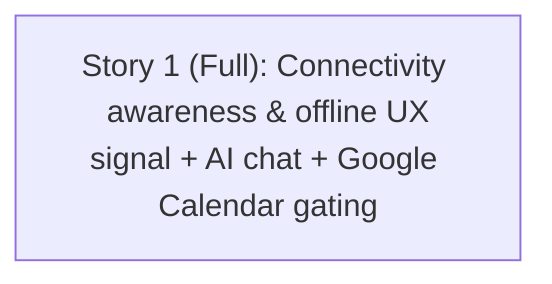

# Windows Desktop / Offline-LAN — Phase 3 Stories (Connectivity Awareness & Offline UX)

**Plan:** [../plan.md](../plan.md) (APPROVED · Challenged) — Phase 3 only (FR-D + US-6)
**Spec:** [../spec.md](../spec.md) (APPROVED · Challenged) — umbrella, 5 phases

> Phases 1 (pluggable auth) and 2 (local-disk storage) are **COMPLETE**. Phase 1 planning artifacts are archived under [../phase-1/](../phase-1/). This folder tracks **Phase 3** only.

## Summary

Add **connectivity awareness** so the Local (offline-LAN) install degrades gracefully. The two internet-dependent features — **AI chat (HuggingFace)** and **Google Calendar** — are visibly disabled with a "requires internet" affordance when the internet is unreachable, and re-enable automatically (debounced) when it returns. Core features keep working fully offline. Appointments not yet pushed to Google show a **"not synced to Google"** badge with a manual **"Push to Google"** action.

Internet reachability is judged by the **.NET server** (not the browser), via a new anonymous, Local-mode-only `GET /api/connectivity` endpoint the frontend polls. All behavior is **additive and gated to Local mode**; Cloud is byte-for-byte unchanged.

**Breakdown decision:** delivered as **one full-stack story** (user's explicit choice), covering the plan's US-1 + US-2 + US-3 in a single vertical slice. Steps are grouped by slice so the work stays ordered internally.

## Story Dependencies

_Single story — no inter-story dependencies. Internal ordering: connectivity signal (backend + provider) → AI chat gating → appointment sync field + Google Calendar UI._

## Status Tracker

| Story | Layer | Name | Status | Depends On |
|-------|-------|------|--------|------------|
| 1 | Full | Connectivity awareness & offline UX | implemented | - |
