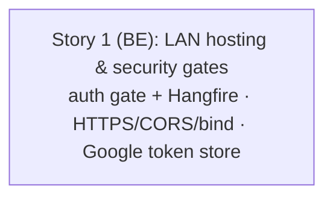

# Windows Desktop / Offline-LAN — Phase 4 Stories (LAN Hosting & Security Gates)

**Plan:** [../plan.md](../plan.md) (APPROVED · Challenged) — Phase 4 only (FR-E + AC-1.2a)
**Spec:** [../spec.md](../spec.md) (APPROVED · Challenged) — umbrella, 5 phases

> Phases 1 (pluggable auth), 2 (local-disk storage) and 3 (connectivity awareness) are **COMPLETE**. Phase 1 & 3 planning artifacts are archived under [../phase-1/](../phase-1/) and [../phase-3/](../phase-3/) (Phase 2 was a single feat commit, no pipeline archive). This folder tracks **Phase 4** only.

## Summary

Harden the Local (offline-LAN) install so it is safe to expose on a clinic network — the spec's **release-gate** phase. Three backend outcomes: **(A)** every HTTP surface requires authentication or is a deliberate, explicit anonymous exception (a Local-mode `FallbackPolicy` makes endpoints fail **closed**; the two anonymous-by-omission controllers are covered; Hangfire is server-PC-only); **(B)** LAN clients can connect from a configurable CORS origin over HTTPS when a cert is supplied — with plain-HTTP LAN still working when it isn't — and the bind is config-driven; **(C)** the Google OAuth refresh token persists to a gitignored `.local/` file instead of rewriting the committed `appsettings.json`.

All behavior is **additive and gated to Local mode** (`Auth:Mode = Local`) or behind inert defaults; **Cloud is byte-for-byte unchanged**. HTTPS **cert generation** and the **client-side CA trust import** are Phase 5 (installers); Phase 4 delivers the serving capability against any operator-supplied cert. This phase is **backend/config only — no frontend changes**.

**Breakdown decision:** delivered as **one backend story** (user's explicit choice), covering the plan's US-1 + US-2 + US-3. Steps are grouped by slice so the work stays ordered internally: the auth gate (Slice A) lands first since it defines the `[AllowAnonymous]` carve-outs the token-store slice (Slice C) coexists with; HTTPS/CORS (Slice B) is independent.

## Story Dependencies

_Single story — no inter-story dependencies. Internal ordering: Slice A (auth release gate + Hangfire lockdown) → Slice B (HTTPS serving + CORS + configurable bind) → Slice C (Google OAuth token store, depends on Slice A's `[AllowAnonymous]` carve-out)._

## Status Tracker

| Story | Layer | Name | Status | Depends On |
|-------|-------|------|--------|------------|
| 1 | BE | LAN hosting & security gates | implemented | - |

## Test Plan Coverage

| Test Type | Plan | Status |
|-----------|------|--------|
| E2E (`test-plan-e2e.md`) | not created | skipped (backend/config only — no new UI) |
| API (`test-plan-api.md`) | not created | skipped (Postman/Newman not run per user preference) |
| Integration (`test-plan-integration.md`) | not created | skipped (no APPROVED plan; backend covered by xUnit unit tests) |

Automated coverage for this phase is **backend xUnit + Moq** unit tests (authorization policy, loopback helper, CORS assembly, token store, controller attribute-coverage reflection scan). Frontend gate is `tsc --noEmit` + `npm run build` — but no FE change is expected.
