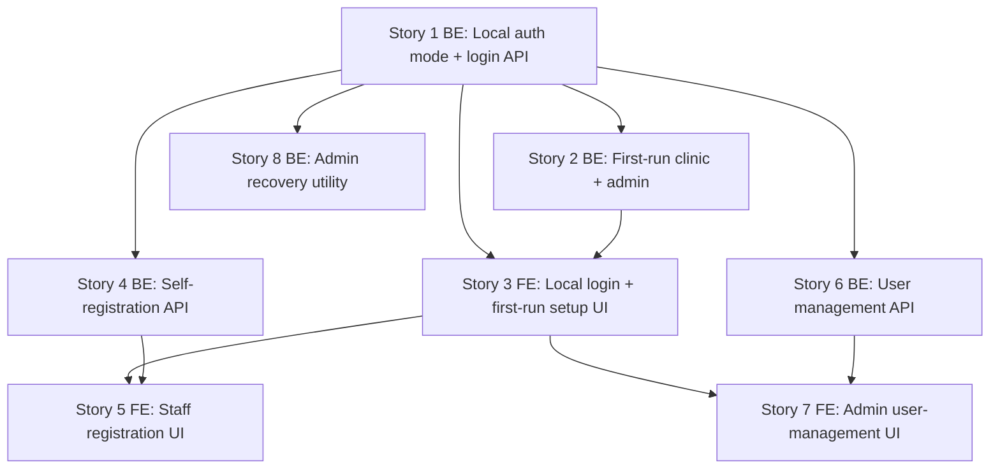

# Windows Desktop / Offline-LAN — Phase 1 Stories (Pluggable Auth + Local Accounts)

**Plan:** [../plan.md](../plan.md) (APPROVED · Challenged)
**Spec:** [../spec.md](../spec.md) (APPROVED · Challenged)

## Summary

Phase 1 adds a config-selected **Local (offline) auth mode** alongside the existing **Cloud (Auth0) mode**, without changing Cloud behavior. Local mode uses email+password accounts on the existing `User` entity, the API mints its own signed JWT, and the frontend reuses the existing `Authorization: Bearer` seam via an HttpOnly cookie-backed session.

The plan's 4 full-stack stories are split into **8 single-layer stories** (5 Backend, 3 Frontend) per the BE/FE separation rule, so each is independently implementable, reviewable, and testable.

## Story Dependencies

## Status Tracker

| Story | Layer | Name | Status | Depends On |
|-------|-------|------|--------|------------|
| 1 | BE | Local auth mode + login API | done | - |
| 2 | BE | First-run clinic + admin creation (localhost-only) | done (review skipped) | 1 |
| 3 | FE | Local login + first-run setup UI | done (review skipped) | 1, 2 |
| 4 | BE | Staff self-registration API (clinic code) | done (review skipped) | 1 |
| 5 | FE | Staff registration UI | implemented | 3, 4 |
| 6 | BE | Admin user-management API | not-started | 1 |
| 7 | FE | Admin user-management UI | not-started | 3, 6 |
| 8 | BE | Admin lockout-recovery utility | not-started | 1 |

## Cross-cutting constraint (every story)
Cloud/Auth0 mode must remain fully working. Each story re-verifies the Cloud path is unaffected (all Local behavior is mode-gated on `Auth:Mode` / `AUTH_MODE`).

## Suggested implementation order
1 → 2 → 3 (critical path to a working offline login), then 4→5, 6→7, and 8 in any order (all depend only on 1 / the FE base 3).
