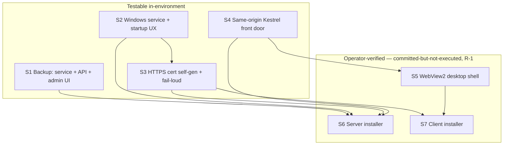

# Windows Desktop / Offline-LAN — Phase 5 Implementation Stories

**Plan:** [../plan.md](../plan.md) (APPROVED · Challenged 2026-07-09)
**Spec:** [../spec.md](../spec.md) (APPROVED · Challenged) — umbrella spec, `## Delivery Phases`

## Summary

Phase 5 (the **final** phase) turns the hardened Local-mode app from Phases 1–4 into **installable Windows software**: an admin-only one-click backup, an auto-starting Windows service with clear startup-failure messaging, server-side HTTPS cert self-generation, a same-origin Kestrel front door, a thin WebView2 desktop client, and server + client installers. All behavior is **additive and gated to Local mode**; **Cloud stays byte-for-byte unchanged**.

Phases 1–4 are COMPLETE; their pipeline artifacts are archived under [`../phase-1/`](../phase-1/), [`../phase-3/`](../phase-3/), and [`../phase-4/`](../phase-4/) (Phase 2 was a single feat commit, no pipeline archive).

## Story structure — single full-stack story (explicit user decision)

> **Departure from the default BE/FE-split rule (user-requested, 2026-07-09):** all of Phase 5 is delivered as **one `Layer: Full` story**. Its Steps are grouped into ordered slices **S1–S7** mirroring the plan's US-1…US-7, so the internal build order stays explicit. Slices are implemented in order; later slices depend on earlier ones.

## Slice ordering (within the single story)

## Status Tracker

| Story | Layer | Name | Status | Depends On |
|-------|-------|------|--------|------------|
| 1 | Full | Phase 5 — Packaging, Installers & Manual Backup (slices S1–S7) | in-progress (S1–S4 implemented; S5–S7 deferred to a packaging session) | - |

### Internal slice map (for reference — all within Story 1)

| Slice | Plan | Scope | Verifiable here? | Slice deps |
|-------|------|-------|------------------|------------|
| S1 | US-1 | One-click admin backup (service + API + UI) | ✅ unit + integration | none |
| S2 | US-2 | Windows service + startup-failure messaging | ✅ (console) | none |
| S3 | US-3 | HTTPS cert self-gen + fail-loud transport | ✅ unit | S2 |
| S4 | US-4 | Same-origin Kestrel front door | ✅ builds/manual | none (FE audit) |
| S5 | US-5 | Thin WebView2 desktop client | ⊘ operator (R-1) | S4 |
| S6 | US-6 | Server installer (bundled PG + services + cert) | ⊘ operator (R-1) | S1, S2, S3, S4 |
| S7 | US-7 | Client installer (shell + CA trust) | ⊘ operator (R-1) | S3, S5 |
